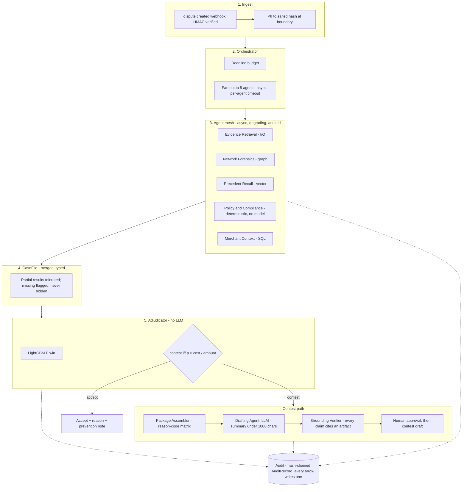

# Praman

**A chargeback defense system.** It decides whether a merchant should contest or
accept a payment dispute, assembles the evidence package the specific reason
code actually requires, detects cross-merchant abuse rings, and drafts the
representment narrative without fabricating anything.

*Pramāṇa* (प्रमाण) is the Sanskrit term for a valid means of knowledge — the
branch of Indian epistemology concerned with what counts as admissible evidence
for a claim. This is a machine that decides what evidence is sufficient to
support a claim before a deadline. The name is the spec.

**Live console:** [praman-console.onrender.com](https://praman-console.onrender.com)
— deployed straight from this repo as a static site (`render.yaml`); nothing
server-side runs, since the evidence engine, adjudicator and agent mesh are a
deterministic offline pipeline whose output is exactly the JSON already built
into the site. Free tier, so a cold start after idle can take 30–60s.

---

## The problem, in money

A dispute arrives. The disputed amount is debited from the merchant's balance
immediately and held against the outcome. The merchant has until `respond_by` to
accept the loss or contest it with evidence.

Three things go wrong, in descending order of cost:

1. **Default-by-silence.** Small merchants do not respond at all. The deadline
   passes, the dispute is auto-lost. This is an operations failure, not a
   modelling one — the evidence usually existed and nobody assembled it in time.
2. **Contest-everything.** Larger merchants fight reflexively. Representment
   costs money, and losing disputes you were always going to lose burns ops
   hours and drags the dispute ratio without recovering anything.
3. **Wrong evidence.** The merchant responds with documents that do not satisfy
   the reason code the issuer actually raised. Visa 13.1 wants delivery
   confirmation; a screenshot of the order page loses the case with paperwork
   attached.

Every one is a decision problem with an asymmetric, amount-dependent cost.

### The insight

**A merchant sees one dispute. The aggregator sees the ring.**

One merchant cannot distinguish an honest customer whose parcel went missing
from a serial abuser running the same claim across eleven merchants with three
cards and one shipping address. Only an entity sitting across many merchants can
see that. So Praman resolves entities across merchants, detects abuse rings, and
feeds the finding back into the evidence package **as an exhibit** — a
documented pattern of coordinated claims is itself compelling evidence in a
representment, and no per-merchant tool can produce it.

---

## Results

<!-- RESULTS: regenerated by `make data && make validate && make eval`. Nothing
     goes in this section that those commands do not print from a clean checkout. -->

### The finding

**The trivial policy beats the ML policy. The sophisticated policy beats the
trivial one by 5.5%.**

Held-out test split, 4,375 disputes across 25 merchants the model never saw.
Every policy decides and settles on the same outcome (ADR-010).

| Policy | Net | Contested | False-positive cost |
|---|---|---|---|
| Accept everything — what silent merchants do | ₹0 | 0% | ₹0 |
| **Contest everything (t = 0)** — thinking about nothing at all | **₹89,12,555** | 100% | ₹9,80,350 |
| Model at a naive p > 0.5 — a competent ML submission | ₹50,40,079 | 25% | ₹1,29,150 |
| Model at the best tuned constant, t* = 0.240 | ₹91,11,449 | 70% | ₹5,34,100 |
| **Model + expected-cost rule** | **₹94,04,449** | 51% | ₹3,95,850 |

Read the third row against the second. **A competent classifier with a naive
threshold nets ₹50.4 lakh, against ₹89.1 lakh for contesting everything and
thinking about nothing at all.** The ML policy is ₹38.7 lakh *worse* than the
trivial one. Then the full system recovers that and adds 5.5% on top.

**The mechanism.** Break-even is `C/A`. At a ₹350 contest cost against typical
Indian dispute values, the optimal constant threshold collapses toward zero —
fitted on held-out data it lands at **t\* = 0.240**, and contest-everything is
simply t = 0. When the bar is that low, improving the probability estimate barely
moves the decision. The amount distribution drives the money, not the
probability.

### The result depends on your ops cost, and here is the curve

**C = ₹350 is an assumption, not a measurement.** It is a merchant input, and the
entire finding above is conditional on it. Sweeping it:

| C | t\* | Contest everything | Best constant | EV rule | Rule edge |
|---|---|---|---|---|---|
| ₹100 | 0.035 | ₹1,00,06,305 | ₹99,95,029 | ₹1,00,66,749 | +0.7% |
| ₹350 | 0.240 | ₹89,12,555 | ₹91,11,449 | ₹94,04,449 | +3.2% |
| ₹1,000 | 0.370 | ₹60,68,805 | ₹72,65,593 | ₹82,25,047 | **+13.2%** |
| ₹2,000 | 0.440 | ₹16,93,805 | ₹48,27,419 | ₹72,10,431 | +49.4% |
| ₹5,000 | 0.695 | **−₹1,14,31,195** | ₹2,93,278 | ₹51,36,214 | +1651% |

`t*` rises monotonically with C, as it must — a higher cost of contesting demands
a higher probability before contesting is worth it.

**At low contest cost the arithmetic dominates and a trivial policy is nearly
optimal**, because almost everything clears break-even. As ops cost rises the
threshold rises, fewer disputes are worth contesting, and discriminating *which*
ones starts to pay. **The crossover is at C ≈ ₹1,000**: that is where the rule's
edge over the best constant becomes material (13.2%) and where contest-everything
stops being within 10% of optimal. By ₹5,000, contesting everything is not merely
suboptimal — it **destroys ₹1.14 crore**.

So the honest statement is not "the system adds 5.5%." It is: *the system's value
is a function of your ops cost, ₹350 sits at the cheap end of that curve where it
is worth least, and the value rises steeply from about ₹1,000 upward.* A merchant
paying a team to prepare representments is far past that point.


### What each component is actually worth

| Remove | Net | Cost of removing it |
|---|---|---|
| Nothing (full system) | ₹94,04,449 | — |
| Network features | ₹93,96,273 | −₹8,176 |
| Evidence features | ₹93,45,174 | −₹59,276 |
| **The expected-cost rule** → best tuned constant t* | ₹91,11,449 | **−₹2,93,001** |
| _(the same, against a naive t = 0.5)_ | _₹50,40,079_ | _−₹43,64,371_ |

**The ablation is the tuned constant, not 0.5.** Contest-everything is itself a
constant threshold at t = 0, so the best constant can never be worse than it, and
comparing the rule against 0.5 measures only that 0.5 is a bad constant —
overstating the rule by an order of magnitude. The honest figure is ₹2,93,001,
which is still **4.3× everything the model's features contribute together**
(₹67,452).

That ratio, not a large multiple, is the claim: on this problem the decision rule
outweighs the model, and most of the achievable money is available to a policy
with no model in it at all.

### Does it actually run

`make system` puts real cases through the real mesh and times them.

| | Measured | |
|---|---|---|
| p50 time to decision | **0.6ms** | in-process, one machine |
| p95 time to decision | **0.8ms** | target < 6s (SPEC §15) |
| Slowest agent | `evidence`, p95 **0.140ms** | the one doing I/O; the other four are under 0.01ms |
| Evidence degradation at `drop_rate` 0.30 | **54%** | and all 100 cases still decided |
| Drafting calls | **0.38 per dispute** | one per *contested* dispute, none for an accepted one |

**Read the latency as a floor, not a prediction.** There is no network between
these agents and their retrieval is stubbed, so a real deployment is strictly
slower. What it establishes is that nothing here is accidentally quadratic and
that the deadline budget has room to work.

**No rupee cost is quoted for the model.** No hosted provider is wired up, so
the price side of that multiplication is a number this repository does not have.
Call count is the half it can measure, and it is the half reported. The
architecture is also the cost model: the model never runs on a dispute the rule
declined, so declining 62% of a sample is 62% of the model spend that never
happens.

### Metrics

| Metric | Value | |
|---|---|---|
| PR-AUC | **0.6609** at a 0.360 base rate | **misses the ≥0.80 target** — see below |
| ROC-AUC | 0.7920 | under the 0.897 corpus ceiling, so no leak |
| Calibration ECE | 0.0190 | target ≤ 0.05 |
| Corpus | 17,500 disputes · 100 merchants · 60 rings · 90 decoys | bit-reproducible |
| Splits | exactly 60/15/25 by merchant | winnable-rate spread 0.031 |

**PR-AUC misses its target and the miss is reported, not adjusted.** The ≥0.80
figure was set before the economics were measured. A mediocre classifier that
barely moves the money is exactly what the central finding predicts, so the miss
is consistent with the result rather than a refutation of it. The target is
revised in `docs/SPEC.md` §15 with the reasoning recorded in ADR-011 — the
metric was not changed to hit the number.

**On false-positive cost.** The rule's ₹3,95,850 is roughly 3× the naive
threshold's ₹1,29,150, and that is the correct purchase rather than a
regression: it buys recall 0.708 against 0.452 and ₹43.6 lakh more net. Each
wasted contest costs ₹350; each recovered dispute is worth thousands. Minimising
false-positive cost is the wrong objective here, which is why the bar asks for it
to be **reported** rather than optimised.

### Precision and recall by amount decile

The expected-cost rule has **no single threshold** — it is `C/A`, and a ₹500
dispute is judged at 0.70 while a ₹50,000 one is judged at 0.007. A single
precision/recall pair for it is not well-defined, so here are ten:

| Amount range | n | Precision | Recall | Contested |
|---|---|---|---|---|
| ₹70 – ₹319 | 438 | — | 0.000 | 0% |
| ₹319 – ₹468 | 438 | — | 0.000 | 0% |
| ₹468 – ₹649 | 438 | 0.804 | 0.279 | 12% |
| ₹649 – ₹963 | 438 | 0.638 | 0.604 | 29% |
| ₹968 – ₹1,413 | 438 | 0.539 | 0.929 | 67% |
| ₹1,416 – ₹2,063 | 437 | 0.524 | 0.964 | 71% |
| ₹2,064 – ₹3,400 | 437 | 0.537 | 0.970 | 68% |
| ₹3,409 – ₹7,412 | 437 | 0.493 | 0.961 | 69% |
| ₹7,417 – ₹16,004 | 437 | 0.393 | 0.994 | 97% |
| ₹16,025 – ₹2,70,401 | 437 | 0.462 | 1.000 | 100% |

Precision **falls** as the amount rises and recall climbs to 1.00. That is the
rule working: above roughly ₹16,000 almost any probability clears break-even, so
it knowingly accepts many losing contests because each win is worth two orders of
magnitude more than the ₹350 it costs to try. The bottom two deciles are never
contested — worth less than the cost of contesting them — so precision there is
undefined, not zero.

A ≥0.80 precision target does not apply to a policy whose threshold is a function
of the amount.

### Ring detection

Measured on rings, not on money. Two stages: connected components over the
salted entity graph (cheap, deliberately over-inclusive), then cohesion scoring
on temporal concentration, merchant span, code homogeneity and disputes per
member. Threshold chosen on the calibration split to hold precision ≥ 0.85.

| Split | Candidates | Rings | Precision | Recall | False-ring rate |
|---|---|---|---|---|---|
| Calibration | 26 | 12 | 0.900 | 0.750 | 0.071 |
| **Test** | 45 | 21 | **0.938** | 0.714 | **0.042** — 1 of 24 |

#### The slow ring is a finding, not a gap

| Ring profile | Rings | Caught | Recall | 95% interval | Median burst/day |
|---|---|---|---|---|---|
| `address_cluster` | 9 | 9 | 1.000 | [0.70, 1.00] | 1.52 |
| `device_farm` | 8 | 6 | 0.750 | [0.41, 0.93] | 2.10 |
| **`instrument_rotation`** | 4 | 0 | **0.000** | **[0.00, 0.49]** | **0.35** |

**Burst rate is the only feature that separates rings from households.** They
share entities by construction, they span comparable numbers of merchants, and
the corpus builds both by the same code path. So **a ring that adopts household
tempo is undetectable by this method at any acceptable precision** — not merely
missed by a threshold that could be lowered. Lowering the burst weight trades
directly against the precision floor and the false-ring rate.

**The denominator matters.** 0 of 4 is a point estimate of 0.000 with a 95%
Wilson interval of [0.00, 0.49] — consistent with any true recall below roughly a
half. Four groups cannot say more, and quoting 0.000 as though it were precise
overstates both the failure and our knowledge of it.

**Slow rings need a different signal, not a lower threshold**: instrument reuse
velocity relative to identity churn, or cross-merchant coordination in *what* is
claimed rather than *when*. Neither is built.

**Adversarial consequence, stated because the track is defense-only.** Publishing
a burst-based detector teaches the evasion — slow down. That is a real argument
for burst detection being a **component inside a larger system** rather than a
standalone product, and it is why the ring finding feeds the evidence package
rather than being the product.

**False-ring rate is reported separately and never folded into an aggregate.**
Reporting an innocent household as a fraud ring is the worst error this system
can make, so precision carries a floor and recall does not. A missed ring costs
one merchant one dispute; an accused family is something else entirely.

Structure does not separate rings from households — both share entities, both
span merchants, and the corpus builds them by the same code path (ADR-006).
Behaviour does: median burst rate is 1.26 disputes/day for rings against 0.07
for decoys, with ranges that overlap.

**Sized honestly.** Network features are worth ₹8,176 against the decision
rule's ₹2,93,001. This is a secondary capability, not the payoff of the
architecture. The exhibit's effect on issuer behaviour is **unmeasured** — the
corpus's issuer model draws from a fixed noise distribution and does not respond
to exhibits, so no claim is made about it.

### Why the network chamber exists

**Not because it is analytically valuable.** Network features are worth
**₹8,176** on the test split against ₹94,04,449 total. Saying anything else would
put the ablation on one slide and have the demo contradict it on the next.

It exists because **the ring finding is spatial and does not survive a table.**
The measured capability is: 60 rings against 90 decoy groups, ring precision
**0.938**, false-ring rate **0.042**, and **56 of the 90 decoy groups sitting
inside the ring burst-rate range**. That last number is the whole difficulty, and
a reader cannot feel it from a row of digits — households and rings occupy the
same structural space, and only tempo separates them. Overlapping communities
also collapse into an unreadable hairball in 2D projection; depth and rotation
are what make them separable.

So the chamber is a **communication surface for a measured capability**, and the
measured monetary value of that capability is printed next to it. It is the most
cuttable thing in the build, a full 2D adjacency fallback ships regardless, and
if it is not smooth it does not ship at all.


### Failure handling

Five agents fan out concurrently under a deadline-derived budget. **Partial
failure is the default path, not an error path.**

`test_decision_survives_each_agent_failure` is parameterised over all five: it
kills each agent in turn and asserts a decision still lands, the degradation is
visible in the output, and the audit chain stays intact. A companion test hangs
each agent instead of killing it, and another kills all five at once.

| Agent killed | Outcome |
|---|---|
| `evidence` | **accept** — refuses to file blind, even at p = 0.99 |
| `network` | contest, confidence widened, degradation reported |
| `precedent` | contest, confidence widened, degradation reported |
| `policy` | contest, confidence widened, degradation reported |
| `merchant` | contest, confidence widened, degradation reported |

Losing evidence retrieval is the one failure that is not survivable *as a
contest*: without it the system cannot know whether a package can be assembled,
and filing blind spends the contest cost to lose the same money. Every other
agent can fail and the case still decides.

Degradation shrinks `p` toward the base rate rather than being absorbed — a
decision built on fewer sources is genuinely more uncertain, and saying so
deterministically is better than a confident number built on half the evidence.

Every step writes a hash-chained `AuditRecord`, including the failures. Editing
any record breaks that record's hash and `verify()` names it, which a test
demonstrates rather than asserts; repairing the edit would force a rewrite of
every record after it, which is what makes the trail tamper-*evident* rather than
merely hashed.

### The console

Opens on a **portfolio view**: sidebar, KPI strip, case queue. It used to open on
one case with no dashboard at all, and that call is reversed in **ADR-013** with
the original argument reproduced rather than deleted — opening on one case is
better for the operator working a queue and worse for a reviewer, who has no case
context to land in.

**Every number on every screen is traceable.** The KPI strip and the policy
ledger read `web/src/metrics.json`, written by `eval/run_eval.py` on the held-out
test split; the fixture breakdown is derived in the browser from `cases.json`.
There is no third source, and no tile is allowed a placeholder — where a number
is not computed yet, the shell says so in words.

Every case on screen went through the real agent mesh and the real evidence
engine (`make console-data`). Nothing is mocked, and the twelve cases are chosen
to include the ones a console usually hides: a blocked package, a WhatsApp thread
refused, a case routed to a human, a partially degraded retrieval, and one worth
less than the cost of contesting it. **The exception list is the product.**

The case view is five parts — verdict, investigation trace, evidence package,
network, drafted narrative — and the evidence part still renders `make trace`'s
own stages: resolve, bind, score, constrain. The content model did not change
when the shell did.

The **investigation trace** shows the five agents in dispatch order with their
real per-case status. Degraded and failed agents render as degraded and failed,
and a non-dismissible banner states which source was lost and that the confidence
band was widened in proportion — silent degradation in a money system is the
failure mode that ends careers. The sidebar rolls the same statuses up across all
twelve cases, worst-state-wins, counted rather than averaged.

**The surface is dark because this is instrument work, not document work.** An
earlier version argued the opposite from document-reading ergonomics, but the
evidence on a case screen is six short lines and the primary job is triaging a
queue against a clock. Warm off-white with near-black type is also the most
recognisable generated-interface signature there is, so that palette read as
templated regardless of its reasoning. The chamber no longer inverts — with the
console already dark it *deepens*, and that descent is still the only transition
in the product.

**The deadline is spatial**: a depleting arc scaled to that reason code's own
filing window, warming from verdigris through ochre to oxblood, so seven days
half gone reads differently from twenty-one days half gone. The rail encodes the
same thing per row — a deadline bar by proximity and a quieter amount bar — so
twelve cases can be triaged in about a second without reading a line.

**It lands on the WhatsApp refusal with one agent already failed**, not on a
clean contest. A case where nothing fires and every agent is green demonstrates
nothing.

The **failure states were designed first**, not last. The WhatsApp refusal is the
product thesis, so it gets the most design on the screen: the document is present,
a published rule refuses it, and the swap that flips the outcome is shown inline.
Below-cost, routed-to-human and degraded-retrieval each get their own treatment
rather than sharing a generic error style.

The **representment narrative** renders on the contest path only. Each sentence
expands to the citations that justify it and the value each cited field actually
holds, so a reader can check the prose against the document rather than trusting
that someone did. A blocked draft renders as blocked, showing what the verifier
stripped and why. Nothing drafted appears for an accepted dispute, because there
is no filing to write.

**Verify integrity** recomputes the SHA-256 hash chain in your browser — 96
records across the 12 cases, with a canonical form byte-identical to Python's
`json.dumps(sort_keys=True)`. **Tamper with a record** edits one in memory and
the same verifier then fails on it. The break is *localised*: the chain names
exactly which record was altered. What the chain costs an attacker is the repair
— recomputing that record's hash changes the next record's `prev_hash`, which
changes its hash, so hiding one edit means rewriting every record after it.
Detection is local; forgery is not. Neither claim is one you have to take on
trust.

One transition exists in the whole product: the descent into the chamber, which
takes the whole viewport, sidebar included. Everything else is instant, and there
are no entrance animations.

Live at [praman-console.onrender.com](https://praman-console.onrender.com), or
run it locally against the fixture set already checked in:

```bash
make console-data && make chamber-data && make console-metrics && make console
cd web && npm run dev
```

### The network chamber

Built to the graph-visualisation reference: `d3-force-3d` layout in a Worker with
positions transferred as `Float32Array`, `InstancedMesh` per node kind (kind by
**geometry**, risk state by colour, so it survives greyscale), edges as a single
`LineSegments`, `invalidate()` on every position update under
`frameloop="demand"`, pointer handlers with `stopPropagation` and raycasting
throttled to 30ms, the highlighted cluster as a **separate object** so selective
bloom targets only it — one post-processing effect, no more.

**The time scrubber is the point**, and it was built before any camera work: you
watch a ring assemble out of orders that looked unrelated when they happened.

A full 2D adjacency fallback ships for three separate reasons —
`prefers-reduced-motion`, absent WebGL, and the fact that some people read a flat
layout faster. It is sortable, carries the same selection model, and for ranking
clusters by burst rate it is genuinely the better view.

The chamber shows the **detector's verdict**, never ground truth recoloured to
look correct: the one false ring and the six missed rings are visible in it as
mistakes. `tests/test_chamber.py` enforces every item on that checklist, because
each one fails silently.

### Corpus honesty checks

| Check | Result |
|---|---|
| Strongest feature outside the label's definition | `evidence_field_count`, AUC **0.603** |
| Evidence vs. `gt_merchant_at_fault` | AUC **0.487** — chance |
| Achievable AUC ceiling (issuer noise) | **0.897** — above this is a leak |
| Ring / decoy overlap | 56 of 90 decoy groups inside the ring burst-rate range |

**Evidence cannot see merchant fault** — 0.487 AUC, indistinguishable from
chance. Nothing in a document cupboard observes whether a merchant actually
failed its customer. That residual is the whole modelling problem.

**Evidence predicts winnability exactly as hard as the definition forces, and no
harder.** `evidence_sufficient` is one of two conjuncts of `gt_winnable`, so it
must predict the label. For a binary conjunct the AUC is pinned at
`(1 + TNR) / 2`; the bound computes to 0.742 and the observed value is 0.742.
That *equality*, not a low number, is the evidence the corpus is honest.

**Network features are derived, never declared.** Cluster membership comes from
connected components over the salted entity graph, computed point-in-time so a
dispute cannot see its component's future. The corpus's own `group_size` and
`in_group` columns are on the forbidden list: they are the generator's record of
how it built each cluster, which production cannot know.

## How it decides

The intellectual core, and the reason this is not a classifier with a 0.5
threshold:

```
Let  A = disputed amount
     C = cost to contest (ops time + representment overhead)
     p = calibrated P(win | contest)

  EV(contest) = p·A − C          win: keep A. lose: keep nothing. always pay C.
  EV(accept)  = 0                the money is already debited

  Contest  ⟺  p·A > C  ⟺  p > C/A
```

The optimal threshold is **a function of the disputed amount**, not a constant.
At C = ₹350, a ₹500 dispute needs p > 0.70 to be worth contesting; a ₹50,000
dispute needs only p > 0.007.

---

## Architecture

Five agents fan out concurrently under a deadline-derived budget, over disjoint
data sources with independent failure modes. Partial failure is the default
path, not an error path. The merged case file goes to a **deterministic**
adjudicator.



A rendered copy for slides and video lives at
[`docs/figures/architecture.png`](docs/figures/architecture.png), regenerated
from the block above with `make diagram` so the two cannot drift.

### Who owns what

The right-hand column is the load-bearing one. It is where the defense-only
constraint actually lives, and every row of it is enforced by a test rather than
by a convention.

| Layer | Owns | Never does |
|---|---|---|
| Orchestrator | Fan-out, per-agent budget, partial-failure tolerance | Decide contest vs. accept |
| Agent mesh (5 agents) | Evidence, ring findings, precedent, policy check, merchant context | Set the final action |
| Adjudicator | `P(win)` → deterministic expected-cost rule | Call an LLM, hold write authority |
| Drafting model (LLM) | Draft representment prose, ring narrative | Decide, submit, hold tools |
| Grounding Verifier | Strip/block ungrounded claims | Let an uncited claim through |
| Audit chain | Record and verify every step, tamper-evident | Allow a silent edit |
| Human | Approve draft → `contest()`, or accept | Get bypassed on submission |

**The single most important structural property:** the language model appears
exactly twice — once to narrate a ring finding, once to draft prose. In neither
place does it hold write authority, tool access, or decision power. Contest
versus accept is a deterministic inequality over a calibrated probability.

Every arrow writes an append-only, hash-chained `AuditRecord`.

---

## The failure story

The track asks for one. Here is the grounding verifier refusing to file a
sentence, captured from `make draft` rather than written for the README:

```
disp_JjLlyplWHkjG83  13.1   STRIP unsupported_value
    sentence: The consignment was delivered on 2026-06-10 and signed for by a
              resident at the address, against tracking reference DEL233001175.
    why:      date_iso '2026-06-10' appears in no cited field
              (cited: art_shipping_pro_a257a874.delivered_at,
                      art_shipping_pro_a257a874.signed_by,
                      art_shipping_pro_a257a874.tracking_id)
    -> BLOCKED: Grounding stripped every sentence supporting proof of delivery.
                The draft is blocked rather than filed without it.
```

**Read what that sentence actually was.** Its citations resolved. The artifact
was genuinely in the package. The tracking reference was real. The signature
line was real. The only thing wrong with it was the delivery date — the
document says `2025-11-23` and the sentence said `2026-06-10` — and a verifier
that checked only "do the citations resolve?" would have passed it to an issuer
with a genuine courier record attached to a date that record does not contain.

Catching it takes a third check: every value-shaped token in the prose must
appear in one of the fields the sentence cited. That is the check that earns
the module.

**Then it blocked rather than shortened.** The stripped sentence was the only
one supporting `shipping_proof`, which 13.1 requires, so required coverage fell
from 1.00 to 0.00 and the draft was refused. It would have been easy to emit the
surviving sentences instead — the result reads fluent and complete, and asserts
less than the package promised. Blocking is the designed behaviour, and
`test_stripping_a_required_sentence_blocks_the_draft_rather_than_shortening_it`
holds it there.

**What this is not.** No hosted model is wired up, so that fabrication was
injected by `FaultInjectingProvider`, which deliberately emits the failure modes
a generative drafter exhibits. **This repository does not claim a hallucination
rate for any model, because it has not measured one.** The claim is narrower and
is the one that matters: *this class of error is caught, and the catch is
reproducible.* The default `TemplatedProvider` builds every sentence out of the
field values it cites and cannot fabricate by construction — which is why the
verifier still runs over its output, since a check that only ever runs against
inputs you already trust is not a check.

```bash
make draft     # both providers, and every strip event
```

---

## Status

| Phase | Status |
|---|---|
| 0 — Foundation: repo, scope, ADRs, evidence matrix | complete |
| 2 — Evidence engine (deterministic, no ML) | complete |
| 1 — Data foundation: seeded generator + validated corpus | complete |
| 3 — Adjudicator + expected-cost rule | complete |
| 4 — Network forensics | complete |
| 5 — Agent mesh | complete |
| 6 — Drafting + grounding verifier | complete |
| 7a — Console: case view | complete |
| 7b — Network chamber (3D) | complete |
| 7c — Console shell: sidebar, case queue, audit trail | complete |
| 8 — Evaluation + honesty pass | complete |
| 9 — Submission | complete |

Every phase in the build plan is closed. What is *not* built is stated in
[Limits](#limits) below and in the drafting module's own docstrings — most
importantly that no hosted model is wired up, so the drafting provider that
ships is a deterministic templated one and no hallucination rate has been
measured.

---

## Limits

Stated before you find them, because the alternative is worse:

1. **Absolute numbers are not transferable.** Win rates are learned from a
   seeded generator, not from issuer verdicts. The architecture is
   production-shaped; the numbers are not production-validated. What transfers
   is the relative ordering of policies and the ablations.
2. **Issuer noise is modelled, not observed**, and is homogeneous. Real issuers
   differ substantially by bank.
3. **Entity resolution is assumed away.** Corpus members share entities by
   construction. Real Indian address normalisation is genuinely hard, false
   joins create false rings, and this corpus does not test that failure mode at
   all. It is the system's weakest real-world link.
4. **The required/supporting split is our judgement**, not Razorpay's, which
   publishes a flat suggested-documents list. Different choices move
   completeness scores and therefore winnability.
5. **No temporal drift.** Merchant hygiene and ring tactics are static across
   the corpus window. Real ones adapt.
6. **Contest cost `C` is a merchant input.** The economics are only as good as
   that number, so it is configurable rather than hard-coded.

See [`SCOPE.md`](SCOPE.md) for the defense-only declaration and how it is
enforced structurally, and [`docs/DECISIONS.md`](docs/DECISIONS.md) for the
engineering decision records.

---

## Setup

```bash
python3 -m venv .venv && source .venv/bin/activate
pip install -r requirements.txt

make data           # regenerate the corpus, bit-identically, from a seed
make validate       # corpus honesty checks
make eval           # metrics table, three baselines, ablations, figures
make draft          # draft representments; watch the verifier catch a fabrication
make system         # latency, per-agent degradation, model calls per case
make trace          # watch one case move through the evidence engine
make demo           # real corpus cases and what the engine decided
make test           # unit tests
make verify-matrix  # fail if the matrix is stale against the live docs
make diagram        # re-export the architecture diagram from this README
```

Every number in this file comes from one of those commands on a clean checkout.
Nothing in the results section is hand-typed.

---

## Deploy

Only the console (`web/`) deploys anywhere. There is no live backend to deploy
— the evidence engine, adjudicator, network forensics and agent mesh are a
deterministic, offline pipeline; `make console-data`, `make chamber-data` and
`make console-metrics` produce the exact JSON the built site ships with, and
nothing computes anything further at request time.

`render.yaml` at the repo root is a Render Blueprint: connect this repo on
[Render](https://dashboard.render.com) (**New → Blueprint**) and it builds
`web/` with `npm ci && npm run build`, publishing `web/dist` as a static site.
No environment variables, no database, no server process. Deployed this way at
[praman-console.onrender.com](https://praman-console.onrender.com).
