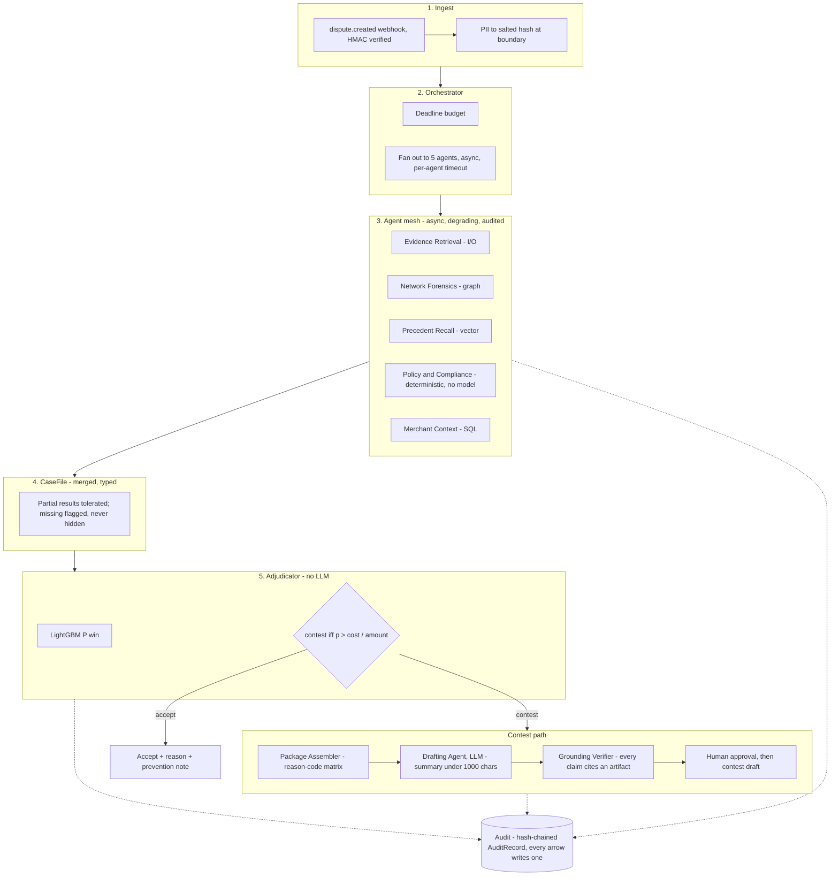

# Praman — Complete Build Specification

**Razorpay AI Buildathon 2026 · Track 02, AI Risk Manager**

Class of loss: **payment disputes lost by merchant inaction, misjudgement, or wrong evidence.**

*Pramāṇa* (प्रमाण) is the Sanskrit term for a valid means of knowledge — the branch of Indian epistemology concerned with what counts as admissible evidence for a claim. The product is a machine that decides what evidence is sufficient to support a claim before a deadline. The name is the spec.

---

## Contents

1. [The problem, in money](#1-the-problem-in-money)
2. [Scope and the defense-only constraint](#2-scope-and-the-defense-only-constraint)
3. [System architecture](#3-system-architecture)
4. [Data model](#4-data-model)
5. [The agent mesh](#5-the-agent-mesh)
6. [The adjudicator and the money rule](#6-the-adjudicator-and-the-money-rule)
7. [Evidence engine](#7-evidence-engine)
8. [Network forensics](#8-network-forensics)
9. [Grounding and anti-hallucination](#9-grounding-and-anti-hallucination)
10. [Data strategy — built and validated](#10-data-strategy--built-and-validated)
11. [Evaluation protocol](#11-evaluation-protocol)
12. [Frontend](#12-frontend)
13. [Stack and repo layout](#13-stack-and-repo-layout)
14. [Build plan](#14-build-plan)
15. [Target metrics](#15-target-metrics)
16. [The five-minute video](#16-the-five-minute-video)
17. [Panel questions](#17-panel-questions)
18. [Failure modes and open risks](#18-failure-modes-and-open-risks)
19. [Appendix A — reason code matrix](#appendix-a--reason-code-matrix)
20. [Appendix B — engineering decisions log](#appendix-b--engineering-decisions-log)

---

## 1. The problem, in money

A dispute arrives. Razorpay debits the disputed amount from the merchant's balance immediately, holding it against the outcome. The merchant has until `respond_by` to accept the loss or contest it with evidence. If they contest, the issuing bank returns a verdict in 15–30 days.

Three things go wrong, in descending order of cost:

**Default-by-silence.** Small merchants do not respond at all. The deadline passes, the dispute is auto-lost, the money is gone. This is not a modelling failure — it is an operations failure. The evidence usually existed; nobody assembled it in time.

**Contest-everything.** Larger merchants fight every dispute reflexively. Representment has a cost, and losing disputes you were always going to lose burns ops hours and drags the dispute ratio without recovering anything.

**Wrong evidence.** The merchant responds but submits documents that do not satisfy the specific reason code the issuer raised. Code 13.1 wants delivery confirmation with a signature; a screenshot of the order page loses the case with paperwork attached.

Every one is a *decision* problem with an asymmetric, amount-dependent cost. None is solved by a chatbot.

### 1.1 The insight the system is built on

**A merchant sees one dispute. The aggregator sees the ring.**

A single merchant looking at a single chargeback cannot distinguish an honest customer whose parcel genuinely went missing from a serial abuser running the same claim across eleven merchants with three cards and one shipping address. Only an entity sitting across many merchants can see that, and a payment aggregator is exactly such an entity.

So Praman does not adjudicate disputes in isolation. It resolves entities across merchants, detects abuse rings, and **feeds the network finding back into the evidence package as an exhibit** — a documented pattern of coordinated claims is compelling evidence in a representment, and no per-merchant tool can produce it.

That is the thing in this build a solo merchant tool cannot copy, and the reason the product belongs at Razorpay specifically.

---

## 2. Scope and the defense-only constraint

### In scope
- One class of loss: dispute/chargeback loss
- Deciding contest vs accept, per dispute, on expected rupee value
- Assembling and validating an evidence package against the reason code's actual requirements
- Detecting cross-merchant abuse rings and rendering them as admissible exhibits
- Drafting the representment narrative, grounded strictly in retrievable facts

### Explicit non-goals
- **Not** a general fraud-scoring platform, and **not** RTO prediction — Razorpay already ships Thirdwatch for that, acquired 2019, 300+ parameters, sub-200ms decisions. Rebuilding it worse is not a demonstration.
- **Not** an auto-submitter. The system produces `action: "draft"` and stops.
- **Not** a persuasion engine. It must be capable of recommending *accept*, and must refuse to assert facts it cannot ground.

### Why the fraud and authorisation codes are out of scope

The published documentation lists roughly forty codes this matrix does not
model: the Visa EMV and fraud-monitoring family, Mastercard 4837 / 4840 / 4849 /
4870 / 4871 / 4808 / 4834, the Amex `F*` / `A*` / `P*` series, RuPay 1104 /
1141 / 1142 / 1143 / 1121 / 1122 / 1123, and Razorpay RZP02 / RZP03 / RZP07.
That omission is deliberate and it is a scoping argument, not a gap.

**They turn on a different kind of evidence.** A fulfilment dispute is won with
documents about what the merchant did: a signed delivery confirmation, a refund
record, an access log, a support thread. A fraud or authorisation dispute is won
with artifacts about how the transaction was authenticated: 3-D Secure results,
AVS and CVV match, EMV chip data, terminal capability, liability shift. Those
are produced by the payment stack at authorisation time, not by the merchant's
records, and they are already present or already absent by the time the dispute
arrives. There is no evidence to *assemble*, no reason-code matrix to resolve,
and no merchant behaviour to change. It is a different evidence model and it
would be a different product.

**And in India they are materially less relevant.** The Reserve Bank of India's
additional-factor-authentication regime means card-not-present transactions
carry a second authentication factor by default. As of 1 April 2026, two-factor
authentication is mandatory across UPI, credit and debit cards and wallets, with
at least one factor dynamic and generated uniquely per transaction; where an
institution fails to implement it, the institution rather than the customer
bears the loss. The RBI has separately directed issuers to validate AFA on
cross-border card-not-present transactions, with full compliance required by
1 October 2026. Authentication that succeeds shifts the fraud liability to the
issuer, so the "no cardholder authorisation" family that dominates
card-not-present chargebacks in un-authenticated markets is a much smaller share
of Indian merchant loss.

Two honest qualifications. First, this reduces the fraud family's relevance
rather than eliminating it: friendly fraud, cases where authentication was
completed by someone in possession of the device, and transactions predating a
compliance deadline all still produce chargebacks. Second, the cross-border
deadline falls after this corpus's window, so the argument is about the
direction of the market rather than a settled state.

The consequence for this build is that the highest-volume *fulfilment* codes are
in scope and the authentication family is not, which is the split the product's
one class of loss actually follows.

Sources: [RBI two-factor authentication guidelines](https://www.business-standard.com/finance/news/rbi-two-factor-authentication-digital-payments-guidelines-2026-125092501154_1.html),
[RBI AFA for cross-border card-not-present transactions](https://www.business-standard.com/finance/news/rbi-proposes-afa-for-online-international-card-not-present-transactions-125020700519_1.html).
Verified 2026-09-05.

### Defense-only declaration

The track disqualifies anything offense-capable. Enforced structurally, not by policy text:

| Capability | Status | Enforcement |
|---|---|---|
| Fabricating evidence or unsupported claims | Prohibited | Grounding verifier strips ungrounded claims; draft blocked if required coverage drops |
| Auto-submitting to an issuing bank | Prohibited | `action` hard-coded to `draft`; submission requires a human approval record |
| Card testing, BIN enumeration, credential probing | Not implemented | No such code path; no PAN is ever stored |
| Fingerprint / velocity evasion tooling | Not implemented | Detection is one-directional; no evasion surface exposed |
| Adversarial generation against fraud models | Not implemented | The generator produces *labelled test fixtures*, never optimised attack sequences |
| Deanonymising real individuals | Prohibited | All identity joins on salted hashes; raw PII never leaves the ingest boundary |

Restate this in `SCOPE.md` at the repo root, in two paragraphs, for the panel.

---

## 3. System architecture

```
                          ┌───────────────────────────────┐
   dispute.created ──────▶│      Ingest / Normalise       │
   (webhook, HMAC verify) │  PII → salted hash at boundary│
                          └───────────────┬───────────────┘
                                          │  CaseFile{} created (empty)
                                          ▼
                          ┌───────────────────────────────┐
                          │       Orchestrator            │
                          │  deadline budget → fan-out    │
                          └───────────────┬───────────────┘
                                          │
        ┌──────────────┬──────────────┬───┴──────────┬──────────────┐
        ▼              ▼              ▼              ▼              ▼
  ┌───────────┐  ┌───────────┐  ┌───────────┐  ┌──────────┐  ┌──────────┐
  │ Evidence  │  │  Network  │  │ Precedent │  │  Policy  │  │ Merchant │
  │ Retrieval │  │ Forensics │  │  Recall   │  │ & Compl. │  │ Context  │
  │  (I/O)    │  │  (graph)  │  │ (vector)  │  │ (determ.)│  │  (SQL)   │
  └─────┬─────┘  └─────┬─────┘  └─────┬─────┘  └────┬─────┘  └────┬─────┘
        │              │              │             │             │
        └──────────────┴──────────────┴─────────────┴─────────────┘
                                          │  partial results tolerated
                                          ▼
                          ┌───────────────────────────────┐
                          │   CaseFile (merged, typed)    │
                          └───────────────┬───────────────┘
                                          ▼
                          ┌───────────────────────────────┐
                          │   Adjudicator  (no LLM)       │
                          │   P(win) → expected-cost rule │
                          └───────────────┬───────────────┘
                             accept ◀─────┴─────▶ contest
                                │                    │
                                ▼                    ▼
                     ┌──────────────────┐  ┌──────────────────────┐
                     │  Accept + reason │  │  Package Assembler   │
                     │  + prevention    │  │  reason-code matrix  │
                     │    recommendation│  └──────────┬───────────┘
                     └──────────────────┘             ▼
                                            ┌──────────────────────┐
                                            │  Drafting Agent (LLM)│
                                            │  summary ≤1000 chars │
                                            └──────────┬───────────┘
                                                       ▼
                                            ┌──────────────────────┐
                                            │ Grounding Verifier   │
                                            │ every claim → cite   │
                                            └──────────┬───────────┘
                                                       ▼
                                            ┌──────────────────────┐
                                            │   Human approval     │
                                            │   → contest(draft)   │
                                            └──────────────────────┘

  Every arrow writes an append-only AuditRecord. The audit log is the product.
```

### 3.1 The same architecture, rendered

The ASCII form above is the one that survives a terminal. This is the one that
survives a code review — same graph, same ownership, nothing added.



**Who owns what, and what each layer is structurally prevented from doing.** The
right-hand column is the load-bearing one: it is where the defense-only
constraint lives, and every row of it is enforced by a test rather than by a
convention.

| Layer | Owns | Never does |
|---|---|---|
| Orchestrator | Fan-out, per-agent budget, partial-failure tolerance | Decide contest vs. accept |
| Agent mesh (5 agents) | Evidence, ring findings, precedent, policy check, merchant context | Set the final action |
| Adjudicator | `P(win)` → deterministic expected-cost rule | Call an LLM, hold write authority |
| Drafting model (LLM) | Draft representment prose, ring narrative | Decide, submit, hold tools |
| Grounding Verifier | Strip/block ungrounded claims | Let an uncited claim through |
| Audit chain | Record and verify every step, tamper-evident | Allow a silent edit |
| Human | Approve draft → `contest()`, or accept | Get bypassed on submission |

---


**The single most important structural property:** the LLM appears exactly twice — once inside Network Forensics to summarise a ring narrative, once in Drafting. In neither place does it hold write authority, tool access, or decision power. Contest vs accept is a deterministic inequality over a calibrated probability. If you take one thing to the panel, take this.

---

## 4. Data model

```python
CaseFile
  case_id, dispute_id, merchant_id, payment_id
  reason_code, phase, amount_minor, currency
  created_at, respond_by, time_budget_remaining
  agent_results: dict[agent_name, AgentResult]   # partial-tolerant
  decision: Decision | None
  package: EvidencePackage | None
  audit: list[AuditRecord]

AgentResult
  agent, status: ok|degraded|failed|timeout
  latency_ms, payload, confidence, errors[]

EvidenceArtifact
  artifact_id, source_system, artifact_type
  api_field                # maps to Razorpay contest() evidence field
  content_hash, retrieved_at
  fields: dict             # structured extraction, each field individually citable

Claim                      # every sentence the LLM writes becomes one of these
  claim_id, text
  citations: list[artifact_id.field]   # empty ⇒ ungrounded ⇒ stripped
  verified: bool

Entity                     # node in the abuse graph
  entity_id, kind: identity|device|address_geo|instrument|merchant
  salted_hash, first_seen, last_seen, degree

RingFinding
  ring_id, member_entity_ids[], merchant_span, dispute_count
  cohesion_score, temporal_concentration, confidence
  exhibit: NetworkExhibit | None

Decision
  action: contest|accept
  p_win, expected_value_minor, threshold_used
  rationale_deterministic: str          # generated from the rule, not the LLM
  model_version, feature_snapshot_hash

AuditRecord
  ts, actor: system|agent:{name}|human:{id}
  event, inputs_hash, outputs_hash, prev_hash   # hash-chained
```

`prev_hash` makes the audit log tamper-evident. In a fintech review this costs twenty lines and buys enormous credibility.

---

## 5. The agent mesh

### Why five agents, when the measurements say the model barely matters?

Answer this before the demo, because the economics finding invites it directly.

**The mesh was never justified by accuracy, and the finding does not touch it.**
§11 shows the classifier is not the binding constraint on recovered rupees. That
is a statement about *model quality*. The mesh is a statement about
*operational robustness*, which is a different axis:

- Five data sources with **independent failure modes** — a courier API, a graph
  computation, a vector search, a deterministic policy resolver, a SQL read.
  They fail differently and at different times.
- Queried **concurrently under a deadline budget** derived from `respond_by`,
  because the binding constraint on this product is a filing deadline, not a
  probability.
- The system must produce a decision **when any subset fails**, with the
  degradation visible in the output rather than silently absorbed.

None of that is an argument about how good the probability is. It is an argument
about whether a decision exists at all when the courier API is down at 4pm on the
day a package is due. If the model were replaced tomorrow by a lookup table, the
mesh would be equally necessary — arguably more so, because the deterministic
core would then carry the whole decision and its inputs would still be flaky.

**The honest inverse.** If there were one data source, this would be a function
call and the mesh would be architecture for its own sake. There are five, they
are genuinely independent, and `test_decision_survives_each_agent_failure` kills
each in turn and asserts a decision still lands. That test is the justification;
the parallelism is just how it is achieved.

Parallelism here is an engineering decision, not a demo feature. The five agents touch disjoint data sources, have independent failure modes, and are latency-bound on different things. Running them serially would triple time-to-decision for zero benefit.

Contract: every agent is `async def run(case: CaseFile, budget_ms: int) -> AgentResult`. Every agent must return within budget, must return *something* (degraded is valid), and must never raise into the orchestrator.

### 5.1 Evidence Retrieval — I/O bound
Walks the merchant's connected sources: order records, shipping and tracking events, support threads, refund records, subscription access logs, published T&Cs and refund policy. Internally fans out again across sources.

Output: `list[EvidenceArtifact]`, each tagged with the `api_field` it satisfies and with structured extraction (delivery date, signature present, tracking carrier, last customer contact).

Degraded: returns whatever answered, marks the rest `unavailable`. Policy then correctly reports the package as incomplete rather than silently producing a weak submission.

### 5.2 Network Forensics — CPU/graph bound
Builds and queries the cross-merchant entity graph (§8). Outputs `RingFinding | None`, a serial-abuse score, and shortest shared-entity paths.

Degraded: if community detection exceeds budget, fall back to 2-hop neighbourhood statistics and mark `degraded`. Never block the decision on graph work.

### 5.3 Precedent Recall — vector search bound
RAG over the merchant's own adjudicated history and the anonymised cross-merchant corpus. Retrieves comparable resolved cases with known outcomes.

This is what makes the win probability explainable: *"Of 41 comparable 13.1 cases with signed delivery proof, 34 were won."*

Retrieval note: embed a **normalised case descriptor** (reason code + evidence field bitmask + amount band + fulfilment channel), not raw text. Raw dispute text is thin and near-duplicate; the descriptor retrieves far better.

### 5.4 Policy & Compliance — fully deterministic, no model
Resolves the reason code against the matrix and computes `completeness_score`, `blocking_gaps[]`, `deadline_feasible`, `constraint_violations[]`.

This agent has no LLM and never will. It is the reference against which everything else is checked.

### 5.5 Merchant Context — SQL bound
Category, dispute ratio trend, historical loss patterns by reason code, fulfilment SLA performance.

Exists to enable the product's most honest output: sometimes the correct recommendation is *accept this dispute, because your 13.1 ratio has tripled in six weeks and your real problem is a courier, not a fraudster.* A risk tool that can only ever say "fight" is a sales tool. Say this in the pitch.

### 5.6 Orchestration semantics

```python
budget = deadline_budget(case.respond_by)      # tighter deadline → tighter budget
results = await asyncio.gather(*[
    guarded(agent, case, budget[agent.name]) for agent in AGENTS
], return_exceptions=False)                     # guarded() never raises
```

- **Per-agent timeouts**, not one global timeout. A slow graph query must not starve evidence retrieval.
- **Partial-failure tolerance is the default path**, not an error path. The Adjudicator receives explicit `missing` indicators and a model trained to handle them.
- **Degradation is surfaced, never hidden.** If Network Forensics timed out, the UI says so and the confidence band widens. Silent degradation in a money system is the failure mode that ends careers.
- **Idempotency:** `case_id` derives from `dispute_id`. Replayed webhooks resolve to the same case. Package assembly writes under a primary key on `(dispute_id, attempt)`.

This is the "one failure handled gracefully" requirement, made architectural rather than anecdotal.

---

## 6. The adjudicator and the money rule

### 6.1 Win probability

Gradient-boosted trees over tabular features. Deliberately not a neural network: the feature space is small, tabular, partially missing, and must be explainable to a merchant who just lost ₹40,000. Reaching for a transformer here would demonstrate the opposite of judgement, and the track explicitly rewards choosing deterministic or simple solutions where AI is unnecessary.

Feature groups:

| Group | Features |
|---|---|
| Reason code | one-hot, plus its required-field bitmask |
| Evidence coverage | per-`api_field` presence, completeness score, blocking-gap count |
| Evidence quality | signature present, delivery-vs-dispute date delta, comms recency, policy published before transaction |
| Payment | method, network, issuer band, instrument age, amount band, payment→dispute latency |
| Network | serial-abuse score, ring membership confidence, ring merchant-span |
| Merchant | category, dispute ratio percentile, historical win rate at this code |
| Missingness | one indicator per agent — "we could not reach the courier API" is itself predictive |

**Calibration is mandatory.** Isotonic regression on a held-out calibration split, with a reliability diagram published in the README. An uncalibrated probability is useless in an expected-value rule, and shipping one invalidates every rupee figure downstream.

### 6.2 The expected-cost decision rule

The intellectual core of the submission. Do not threshold at 0.5. Do not optimise F1.

```
Let  A = disputed amount
     C = cost to contest (ops time + representment overhead)
     p = calibrated P(win | contest)

  EV(contest) = p·A − C        # win: keep A. lose: keep nothing. always pay C.
  EV(accept)  = 0              # baseline: the money is already debited

  Contest  ⟺  p·A > C  ⟺  p > C/A
```

The optimal threshold is **a function of the disputed amount**, not a constant. At C = ₹350, a ₹500 dispute needs p > 0.70 to be worth contesting; a ₹50,000 dispute needs only p > 0.007. That single line reframes the whole problem, and almost nobody in this track will present it.

Refinements if time allows:
- **Deadline-adjusted C** — contesting at T−4h costs more than at T−9d (`rush_multiplier` 1.6)
- **Ratio externality** — contesting and losing nudges the merchant's dispute ratio; add `λ·(1−p)` and expose λ as merchant-tunable risk appetite
- **Ring override** — a high-confidence ring exhibit may justify contesting below the EV line, because it establishes a pattern for subsequent cases from the same ring. Make this an explicit, logged override with its own audit event, never a silent fudge to the probability.

### 6.3 The rationale is generated deterministically

What the merchant sees is templated from decision inputs, not written by the LLM:

> Contest. Evidence covers 4 of 4 required fields for 13.1. Comparable cases: 34 of 41 won. P(win) 0.83, calibrated. At ₹18,400 disputed against ₹350 contest cost, the break-even probability is 0.019. Network: this identity appears in a 7-node ring spanning 3 merchants.

Every number is traceable. Nothing was written by a model.

---

## 7. Evidence engine

The reason-code matrix (Appendix A) encodes Razorpay's published reason-code → required-evidence mapping, projected onto the actual `contest()` API evidence fields:

`shipping_proof`, `billing_proof`, `cancellation_proof`, `customer_communication`, `proof_of_service`, `explanation_letter`, `refund_confirmation`, `access_activity_log`, `refund_cancellation_policy`, `term_and_conditions`, `others[]`

That mapping is the piece almost no competitor will have, because it requires reading the disputes documentation rather than imagining what a chargeback needs.

Assembly pipeline:

1. Resolve `reason_code` → `required[]`, `supporting[]`, `constraints[]`
2. Bind available artifacts to fields; one artifact may satisfy multiple fields
3. Score completeness — required weighted 1.0, supporting 0.3
4. **If any required field is unbound: block.** Emit a named gap list ("no signed delivery confirmation") and route to the merchant with a specific request. Do not let the drafter paper over a missing document with prose. This is what separates a tool from a liability.
5. Enforce constraints (see Appendix A)
6. Emit `EvidencePackage` shaped exactly like the `contest()` request body

Store the matrix as `data/reason_codes.yaml` with this shape:

```yaml
schema_version: 1
scoring:
  required_weight: 1.0
  supporting_weight: 0.3
  block_if_any_required_missing: true
reason_codes:
  "13.1":
    network: visa
    title: Merchandise/Services Not Received
    required: [shipping_proof]
    supporting: [proof_of_service, access_activity_log, customer_communication]
    constraints:
      - { id: delivery_before_dispute, rule: "shipping_proof.delivered_at < dispute.created_at", severity: blocking }
      - { id: signature_strongly_preferred, rule: "shipping_proof.signature_present == true", severity: warn }
```

---

## 8. Network forensics

### 8.1 Graph schema

Undirected multigraph, entity-resolved:

| Node kind | Derived from | Raw value stored |
|---|---|---|
| `identity` | salted hash of (normalised email ∥ phone) | never |
| `device` | device fingerprint hash from checkout | never |
| `address_geo` | normalised address → geohash7 + door-token hash | never |
| `instrument` | network + issuer + last4, salted-hashed | never — no PAN, ever |
| `merchant` | merchant id | n/a |

Edges: `co_occurred_on_order`, `shares_device`, `shares_address`, `shares_instrument`, `disputed_against`.

### 8.2 Ring detection — two stages

One stage alone gives you either noise or nothing.

1. **Candidate generation** — connected components over shared-entity edges above a support threshold. Cheap, high recall, deliberately over-inclusive.
2. **Cohesion scoring** — within each candidate: Louvain modularity, temporal concentration of disputes (rings burst; honest customers don't), merchant span, reason-code homogeneity, dispute-to-order ratio.

A family sharing one address and one device is a component but not a ring. Temporal burst and dispute ratio are what separate them, and getting that distinction right is the whole difficulty.

Report only above a confidence floor. **Ring precision is a headline metric** because ground truth exists in the corpus. Reporting an innocent household as a fraud ring is the worst false positive this system can produce, and evaluation must quantify it separately from dispute-level FPs.

### 8.3 The exhibit

When a ring is confirmed, render a `NetworkExhibit`: the subgraph, the shared-entity paths, the timeline, and a plain-language narrative naming only hashed entities. Attached to the representment under `others[]`.

A merchant submitting *"we believe this customer is a repeat abuser"* has an opinion. A merchant submitting a documented seven-node pattern across three merchants and nineteen days has evidence.

**The slow ring is a finding, not a limitation.** Burst rate is the only feature
that separates rings from households - they share entities by construction and
span comparable merchant counts - so a ring that adopts household tempo is
undetectable by this method at any acceptable precision. Test-split recall on
`instrument_rotation` is 0 of 4, a 95% Wilson interval of [0.00, 0.49]: four
groups cannot say more than "below roughly a half". Slow rings need a different
signal, not a lower threshold - instrument reuse velocity relative to identity
churn, or cross-merchant coordination in *what* is claimed rather than *when*.

Publishing a burst-based detector teaches the evasion. That is a real argument
for burst detection being a component inside a larger system rather than a
standalone product, and it is stated here because the track is defense-only.

**Sized honestly.** Network features are worth **₹8,176** on the test split,
against ₹43,82,246 for the expected-cost rule. This is a secondary capability,
not the payoff of the architecture, and it is measured on **ring precision,
recall and false-ring rate** - not on money. The exhibit's effect on issuer
behaviour cannot be measured in this corpus at all, because the issuer model
does not respond to exhibits: it draws from a fixed noise distribution. That
effect is *unmeasured*, and it is not claimed.

---

## 9. Grounding and anti-hallucination

Non-negotiable, because the output is a factual statement submitted to a bank.

1. The Drafting Agent receives **only** the `EvidencePackage` and structured case fields. No free-text retrieval, no web access, no tools.
2. It emits `Claim` objects, each with `citations: [artifact_id.field]`. Enforced by schema; a claim with an empty citation list is malformed.
3. The **Grounding Verifier** (deterministic) resolves every citation and checks value consistency — a claim stating delivery on 12 March must cite an artifact field whose value *is* 12 March.
4. Ungrounded or inconsistent claims are stripped. If stripping drops required-field coverage below threshold, the draft is **blocked** and escalated, not silently shortened.
5. The final `summary` is assembled from surviving claims, truncated to the API's 1000-character limit with required fields prioritised.

Every strip is logged. Include a real log excerpt of the verifier catching a fabricated delivery date in the README. That is a better failure story than any anecdote you could write, and the track explicitly asks for one.

---

## 10. Data strategy — built and validated

This phase is complete. What follows are measured results from the generator, not intentions.

### 10.1 What is real, what is assumed

| Component | Status |
|---|---|
| Reason codes, titles, descriptions | **Real** — from Razorpay's Submit Evidence docs |
| Required-evidence document lists | **Real** — same source |
| `contest()` API evidence field names | **Real** — Disputes API reference |
| Dispute entity shape, phases, statuses | **Real** |
| Identifier formats (`disp_`, `pay_`, `order_`, `acc_`) | **Real** shape, generated values |
| Required vs supporting split | **Our judgement** — Razorpay publishes a flat list with no required/optional distinction |
| Network attribution (Visa / MC / Amex / RuPay) | **Inferred** from code format — verify before relying on it |
| Merchant, claimant, ring behaviour | **Assumed** |
| Issuer win/loss behaviour | **Assumed** — noise model, not observed |
| Contest cost ₹350 | **Assumed** — defensible default, merchant-configurable |

Anchor object shapes against reality by creating test-mode orders, payments and refunds through the live API and diffing them against generated records. Test-mode keys need no KYC.

### 10.2 Ground truth is factored, not asserted

```
gt_winnable  =  (not merchant_at_fault)  AND  evidence_sufficient
```

The halves are generated independently:

- `merchant_at_fault` comes from the merchant's fulfilment reliability and the claimant's grievance prior. A fact about the world.
- `evidence_sufficient` comes from resolving the reason code against the matrix — required fields present, blocking constraints passed. A fact about record-keeping.

A merchant can be entirely in the right and lose because nobody kept a signed delivery record. A merchant with immaculate records can lose because they genuinely failed to deliver. Both exist in volume, and keeping them separable is what stops the model learning a shortcut.

The **observed** label is drawn by passing ground truth through a noisy issuer: 14% false-loss on winnable cases, 5% false-win on unwinnable ones, plus penalties for late filing and phase escalation. **Train on `observed_won`, never on `gt_winnable`** — ground-truth columns exist for evaluation and for auditing the generator, not as features. Guard this in code, not in a comment; one leaked ground-truth column invalidates every number downstream and it is the easiest mistake to make.

### 10.3 Archetypes

Five merchant archetypes, each with distinct fulfilment reliability, signature capture rate, per-artifact evidence hygiene, support channel mix, reason-code weights, order value distribution and dispute rate:

`d2c_apparel` · `saas_subscription` · `food_delivery` · `electronics` · `thin_records_smb`

Four claimant archetypes with different `merchant_fault_prior`:

| Archetype | Share | P(merchant actually at fault) |
|---|---|---|
| honest_grievance | 52% | 0.88 |
| honest_confused | 23% | 0.14 |
| opportunistic_solo | 19% | 0.06 |
| ring_member | 6% | 0.02 |

Three ring profiles (`address_cluster`, `device_farm`, `instrument_rotation`) and three decoy profiles (`household`, `office_pantry`, `shared_device_pg`).

### 10.4 Splits

Split **by merchant**, stratified by archetype, using largest-remainder allocation.

- *By merchant*, because evidence hygiene is a merchant-level property. A random row split leaks it and inflates every metric.
- *Stratified*, because merchant volume is heavy-tailed — an unstratified shuffle put most corpus volume in the calibration split by chance on the first run.
- *Largest remainder*, as a guard against a ratio that does not divide evenly. At the current 20 merchants per archetype and 60/15/25 split it is **inert** — naive flooring gives the same answer. It was load-bearing at 12 per archetype, where `int(12 × 0.15) == 1` starved calibration. Retained for the configuration change, not claimed as an active fix.
- *Quality-stratified*, because archetype stratification alone left the folds lumpy: within-archetype hygiene spread put d2c_apparel at winnable rates of 0.365 / 0.427 / 0.513. Merchants are quality-sorted inside each archetype and dealt out proportionally, with split volume balanced at the same time.

Rings and decoys are constructed **within a single split's merchant pool**. A ring spanning train and test would leak its structure across the boundary and make test-split ring recall meaningless.

### 10.5 Measured results — seed 20260904

Every figure below is printed by `make data && make validate` from a clean
checkout. Nothing here is inherited; if a number cannot be reproduced by those
two commands it does not appear in this document.

17,500 disputes · 100 merchants · 60 rings · 90 decoys · bit-reproducible across runs.

**Split balance:** train 60% / calibration 15% / test 25% by dispute count — the
requested ratios, hit exactly. Winnable rates 0.392 / 0.385 / 0.416, a spread of
0.031 across folds.

Splits are by **merchant**, stratified by archetype *and* by merchant quality,
allocated by largest remainder. All three parts earned their place by fixing a
measured failure; see ADR-005.

**No feature outside the label's own definition comes close to solving the
task** (exact AUC vs `gt_winnable`):

| Feature | AUC | |
|---|---|---|
| `evidence_sufficient` | 0.742 | definitional — see below |
| `no_blocking_gaps` | 0.742 | definitional |
| `completeness_score` | 0.672 | definitional |
| `required_coverage` | 0.664 | definitional |
| `evidence_field_count` | **0.603** | strongest free feature |
| `group_size` / `in_group` / `group_merchant_span` | 0.581 | |
| `amount_minor` | 0.545 | |
| `signature_present` | 0.519 | |
| `payment_captured` | 0.499 | |

**The leakage check is structural, not a threshold.** `gt_winnable` is *defined*
as `(not merchant_at_fault) and evidence_sufficient`, so an evidence feature is
one of the two conjuncts and **must** predict the label. Asking it not to would
be asking the corpus to contradict itself, and "no feature exceeds 0.64" treats
a structurally determined number as though it were free evidence.

What can be checked is that the conjunct predicts no *better* than the structure
forces. Scoring `W = A ∧ B` by the binary `B`: `W = 1` forces `B = 1`, so TPR is
pinned at 1 and

```
AUC = TPR(1 − FPR) + ½[TPR·FPR + (1 − TPR)(1 − FPR)]
    = 1 − ½·FPR
    = (1 + TNR) / 2
```

with `TNR = P(not sufficient | not winnable)`. On this corpus the sufficiency
rate is 0.708 and the winnable rate 0.397, so the bound computes to **0.742**
and the observed value is **0.742**. That equality — not a low number — is the
evidence the corpus is honest. Anything above the bound would be a leak carrying
information the conjunction does not account for.

**Read the TNR as a property of the corpus, not a diagnostic.** Inverting,
`TNR = 2·AUC − 1 = 0.484`: **48% of losses in this corpus are evidence-driven**
and 52% are merchant fault. An earlier corpus sat at TNR 0.266 — only 27% of its
losses were something better record-keeping could have prevented. Ours is the
better corpus for an evidence product, because more of the loss is the part the
product can actually fix.

**Evidence cannot observe merchant fault.** AUC of `evidence_sufficient` against
`gt_merchant_at_fault` is **0.487** — indistinguishable from chance. Nothing in a
document cupboard observes whether a merchant actually failed its customer. That
residual is the entire modelling problem, and it can only be attacked with
claimant, merchant and network features.

**Issuer noise caps achievable performance.** AUC of `gt_winnable` against
`observed_won` is **0.897**. That is the ceiling. A model reporting above it on
this corpus has a bug or a leak — check the feature allowlist and the split
before touching hyperparameters.

**Ring/decoy discrimination is hard but tractable:**

| | rings | decoys |
|---|---|---|
| Median disputes/day | 1.26 | 0.07 |
| Median disputes | 23.0 | 9.0 |
| Median merchant span | 4.0 | 3.0 |
| Burst-rate range (disputes/day) | 0.05 – 5.50 | 0.02 – 0.94 |

Medians separate them cleanly; the **ranges overlap**, and **56 of the 90 decoy
groups sit inside the ring burst-rate range**. There are slow rings and
dispute-prone households, and that overlap is where ring precision dies. Decoys
are built by the *same code path* as rings (ADR-006), differing only in temporal
concentration and dispute propensity. Building them differently would let the
detector learn the artefact instead of the discrimination.

**The economics headroom is a floor, not a headline.** Test split, with every
policy deciding and settling on `observed_won` (ADR-010):

| Policy | Net |
|---|---|
| Accept everything | ₹0 |
| Contest everything | ₹89,12,555 |
| Oracle, fixed 0.5 threshold | ₹98,92,905 |
| Oracle + expected-cost rule | ₹99,10,355 |

The expected-cost rule adds **₹17,450** over a fixed threshold at a contest cost
of ₹350. That figure is small *by construction*: against a **perfect** classifier
the rule can only improve disputes worth less than the cost of contesting them
(526 of 4,375 test disputes), because a perfect classifier already declines
everything it would lose. The rule earns its keep against a calibrated but
**imperfect** model, where the threshold `C/A` moves across the amount range and
changes far more decisions. §11 reports that number; this one bounds it from
below.

An earlier version of this table let the oracle rows *decide* on `gt_winnable`
while *settling* on `observed_won`, which inflated the headroom by 25%. See
ADR-010, and the general rule it implies: **any baseline must decide and settle
on the same source of truth.**

**Constraints bite.** 29.2% of disputes carry at least one blocking gap:

| Constraint event | Count |
|---|---|
| `warn:signature_strongly_preferred` | 1,725 |
| `rejected:email_channel_only` (RZP06 / RZP00) | 788 |
| `warn:delivered_within_committed_sla` | 449 |
| `blocking:delivery_before_dispute` | 330 |
| `unevaluated:shipped_before_cancellation_request` | 320 |
| `blocking:legibility_check` | 313 |
| `unevaluated:delivered_within_committed_sla` | 301 |
| `blocking:refund_amount_matches_payment` | 273 |
| `blocking:refund_amount_matches` | 205 |
| `blocking:shipped_before_cancellation_request` | 96 |
| `blocking:policy_predates_transaction` | 7 |

Events are labelled by how they fire. `rejected:` is a field qualifier refusing
an artifact at bind time; `blocking:` disqualifies the package; `warn:` shapes
the narrative without blocking; `unevaluated:` is declared unknown. Counting only
violated and unevaluated constraints left `email_channel_only` — enforced at bind
time — out of this table entirely, which is why the labels exist.

The email-not-WhatsApp rule refusing 788 artifacts is the most India-specific
assumption in the design paying off: a large share of Indian SMB support
genuinely lives on WhatsApp, and the documentation explicitly excludes it for
those codes. A real, common, silent way merchants lose disputes with paperwork
attached.

**Unevaluated constraints are declared, not silently passed.** 320 disputes carry
`unevaluated:shipped_before_cancellation_request` because the generator does not
model a cancellation-request timestamp for every case. Marking them unevaluated
rather than assuming they pass keeps winnability from being quietly inflated
(ADR-008).

A constraint governing a document that is *already* reported missing is marked
`not_applicable` instead. Reporting it as "cannot verify" on top of the
missing-field gap counted one absent delivery record as two independent
failures, and produced 2,639 phantom gap events before it was fixed.

### 10.6 Corpus files

| File | Contents |
|---|---|
| `disputes.jsonl` | Per dispute: features, evidence detail, ground truth, observed label, split |
| `merchants.jsonl` | Merchant profiles with archetype and split |
| `groups.jsonl` | Rings and decoys with membership, target merchants, `is_abusive` |
| `entity_edges.jsonl` | Cross-merchant entity graph: identity ↔ device / address / instrument |
| `summary.json` | Corpus statistics, config, seed, noise and economics parameters |

---

## 11. Evaluation protocol

**Dispute-level.** Precision, recall, PR-AUC, and a calibration reliability diagram on the merchant-held-out test split.

**Money-level — the headline.** Expected-cost curve across thresholds, and net rupees against three baselines:

| Baseline | Why it matters |
|---|---|
| Accept everything | What silent merchants actually do today |
| Contest everything | What aggressive merchants do today |
| Fixed threshold at p > 0.5 | What a competent but naive ML submission does |

If you do not beat all three in rupees, you do not have a product. Showing you checked is the point.

**Network-level.** Ring precision and recall against held-out rings, plus **false-ring rate** reported separately with explicit harm framing.

**Grounding-level.** Claim groundedness rate, verifier catch rate, drafts blocked for insufficient evidence.

**Ablations** — three rows, because they prove each component earns its place:
- without network features
- without precedent retrieval
- without expected-cost thresholding (fixed 0.5)

**System-level.** p50/p95 time-to-decision, per-agent latency and degradation rates, LLM calls per case, cost per 100 disputes.

---

## 12. Frontend

### 12.1 Design brief

**Subject:** a dispute defense console for Indian merchants and Razorpay risk analysts.
**Primary job:** decide one case correctly before its deadline, and understand the network behind a repeat abuser.
**Audience:** people who read documents for a living and are accountable for money.

The vernacular of this world is **legal-forensic**, not cyber-security. Cases, exhibits, filing deadlines, verdicts. That vocabulary is not decoration — it is the vocabulary the underlying objects already have, and using any other one would make the screen lie about what it is showing.

**Direction: the evidence binder, inside a familiar shell.** A well-lit forensic document surface, disciplined and dense — reached through a conventional dashboard chrome, with exactly one inversion, where you descend into the network chamber.

The light/dark split is an ergonomic argument, not a stylistic one. Reading a case is document work — tracking records, email threads, T&Cs — and extended document reading in daylight is better on a light surface. Exploring a ring is graph work — long sessions, spatial reasoning, depth perception — and a luminous graph on a dark field has far better figure-ground separation. Same reason a radiologist's reading room is dim but their report prints on white. Persistent chrome — the sidebar — is dark for a third reason: it is navigated by muscle memory, not read, and should recede behind the surface that is.

### 12.2 Tokens

```
Surface        #E8E6E1   ash — cool, not cream; the desk
Paper          #F5F4F1   case card surface
Ink            #16171C   type; near-black is for letters, not backgrounds
Indigo         #2B3A67   structure, headers, primary actions, sidebar accent
Verdigris      #3F7A6E   evidence sufficient / recoverable
Ochre          #B0762A   gap — needs a human
Oxblood        #7A2E2E   loss / accept — ledger red, deep, never alarm red
Chamber        #0D0E12   the network view only
```

The sidebar ground is a near-black tint of Indigo, not a generic navy — the shell should read as this product's, not as a template's. Status colours invert to their luminous forms against it, because a #3F7A6E on near-black is unreadable; the *role* of each colour is fixed, its luminance is not.

Type: **IBM Plex Sans** for chrome and UI. **IBM Plex Mono** reserved strictly for data that must align or be copied: dispute IDs, amounts, UTRs, timestamps, hashes. Mono is a functional choice here, never a label style. **Spectral** narrows to the drafted representment narrative only (§12.4 → Phase 6) — a document serif belongs on the document, and a dashboard shell's chrome does not want one.

### 12.3 The shell

**The app opens on a portfolio view.** This reverses an earlier call in this
document, and the reversal is recorded in **ADR-013** with the original argument
reproduced rather than deleted. The short version: opening on one case is better
for the operator and worse for the reviewer, and the reviewer has no case context
to land in.

**Sidebar** — persistent, dark, four things and no more:

1. Product name and track subtitle.
2. Nav: **Case Queue** (landing) · **Network Chamber** · **Audit Trail**.
3. **System status**, wired to real state. Per-agent health rolled up across the
   loaded cases from `CaseFile.agent_results` — ok / degraded / failed, counted,
   never averaged into a single green dot. Audit chain: hash-chained, verify on
   demand. Drafting model: **states plainly that Phase 6 is not built**. A status
   panel that only ever reports health is decoration; this one reports the gap.
4. The **defense-only callout**, pinned at the bottom, quoting `SCOPE.md` rather
   than paraphrasing it.

**Landing — Case Queue:**

- **KPI strip.** Real numbers only, and every one of them traceable: net rupees
  for the expected-cost rule against all three baselines, ring precision and
  false-ring rate, the share of disputes carrying a blocking evidence gap, and
  the fixture set broken down by decision. The first three come from
  `web/src/metrics.json`, written by `eval/run_eval.py` on the held-out test
  split; the last is derived in the browser from `cases.json`. **No tile is
  permitted a placeholder.** Where a number is not computed yet, the shell says
  so in words.
- **Data-provenance line**, adjacent to the strip: twelve real disputes through
  the real agent mesh, and metrics from the 4,375-dispute held-out split. State
  what is synthetic. It is stronger ground than most of this category stands on,
  and hiding it would forfeit that.
- **Case queue.** One row per fixture case: dispute ID, reason code, amount,
  decision, deadline countdown, status pill. Sorted by deadline, because that is
  still what forces action even when it is no longer the hero of the screen.

**Case detail**, five parts in this order:

1. **Verdict banner** — contest/accept, `P(win)`, break-even `C/A`, expected
   value. The threshold is never shown without the probability it is compared
   against, or the recommendation becomes unauditable by the person acting on it.
2. **Investigation trace** — one line per agent, in run order, each tagged with
   its real status. Degraded and failed agents render as degraded and failed.
   This is the mesh's actual behaviour, not a fixed narrative with a spinner.
3. **Evidence checklist** — required vs. supporting, blocking gaps named in
   ochre ("No signed delivery confirmation"), never generic.
4. **Network summary** — cluster size and merchant span where one exists, with a
   link into the chamber.
5. **Drafted narrative** — Phase 6. Space is designed for it now, and it renders
   as an explicit not-yet rather than being hidden.

**Audit Trail** — the hash-chained `AuditRecord` list as a timeline, and a
**Verify Integrity** action that recomputes SHA-256 over every record in the
browser and checks each `prev_hash` against the record before it. It is a real
check on real data, not an affordance that always reports success; a **Tamper**
control edits one record in memory so the break can be watched propagating
forward. A claim of tamper-evidence the reader has to take on trust is not
evidence of anything.

**What the shell does not do.** It does not score a new case interactively.
The twelve fixtures are pre-computed through the real mesh; a live scorer would
be new scope wearing a UI reskin's clothes, and it is explicitly out.

### 12.4 The network chamber — the one 3D surface

Opening the network **inverts the whole screen** to `#0D0E12`. That inversion is the only dramatic gesture in the product, and it earns its place by signalling a genuine mode change.

- 3D force-directed graph, `react-three-fiber` + `drei`, layout computed by `d3-force-3d` in a **Web Worker** so the main thread never stutters
- **Instanced meshes** for nodes; target 5,000 nodes at 60fps. Node kind by geometry, not colour alone — colour carries risk state
- Camera flies to the disputed identity on open; the shared-entity path to co-disputants lights as a continuous ribbon. **That path is the exhibit** — the same object attached to the representment
- **Time scrubber** replaying ring formation over weeks. This is the moment that sells the pitch: you *watch* the ring assemble out of unrelated-looking orders
- Selective bloom on the highlighted path only. No particles, no starfield, no glass
- `prefers-reduced-motion` disables auto-rotation and camera flight; a flat adjacency view is a full 2D fallback for accessibility and weak GPUs

**Justify it to the panel honestly, which is not the same as enthusiastically.**
The chamber is *not* justified by analytical value: network features measure at
₹8,176 against ₹94,04,449 total, and claiming otherwise puts the ablation on one
slide contradicting the demo on the next.

It is justified as a **communication surface for a measured capability**. The
finding is spatial and does not survive a table: 60 rings against 90 decoys, ring
precision 0.938, false-ring rate 0.042, and 56 of the 90 decoy groups sitting
inside the ring burst-rate range. That overlap is the entire difficulty of the
problem and a reader cannot feel it from digits. Overlapping communities also
collapse into an unreadable hairball in 2D projection, and depth plus rotation
are what separate them.

Say the ₹8,176 out loud when showing it. A demo that quietly implies the chamber
is where the money is will be caught, and correctly.

### 12.5 Restraint rules
- One accent per state, never two
- No motion the user did not trigger, except the single ring-formation replay
- Amounts always tabular-aligned mono, always with currency, always Indian digit grouping, never abbreviated to "18.4k" in a decision context
- Every identifier, hash and timestamp in mono; every label, heading and badge in sans. Wall-to-wall mono is a costume, not a system
- Empty and blocked states give instructions, not mood: *"No signed delivery confirmation. Request from courier, or accept."*
- A number on screen is either traceable to `metrics.json`, derived in view from `cases.json`, or absent. There is no fourth option

---

## 13. Stack and repo layout

| Layer | Choice | Why |
|---|---|---|
| API | FastAPI, Python 3.11, async | The agent mesh is I/O-bound; async is the whole point |
| Store | Postgres | Idempotency needs real primary keys and transactions; SQLite for local dev |
| Vector | pgvector | One datastore beats two at this size |
| Graph | NetworkX in-process, snapshotted | Neo4j is not justified at this scale and adds ops surface |
| Model | LightGBM + isotonic calibration | Tabular, small, explainable, fast |
| LLM | Any hosted model with structured output; provider behind an interface | Constrained to drafting and ring narration only. Swappable by design — nothing in the architecture depends on a specific vendor |
| Frontend | React + Vite, react-three-fiber, d3-force-3d | 3D where justified, plain DOM everywhere else |
| Eval | pytest + `make eval` emitting the metrics table | One command reproduces every number in the README |

```
praman/
├── README.md                 # problem → results table → architecture → limits
├── SCOPE.md                  # defense-only declaration
├── docs/
│   ├── SPEC.md               # this document
│   └── DECISIONS.md          # ADRs, one per non-obvious choice
├── data/
│   ├── reason_codes.yaml     # the evidence matrix
│   ├── generator/            # archetypes.py, build.py — seeded, reproducible
│   ├── corpus/               # generated output, gitignored
│   └── README.md             # what is real, what is synthetic
├── praman/
│   ├── ingest/               # webhook, HMAC verify, PII hashing boundary
│   ├── orchestrator/
│   ├── agents/               # one module per agent, identical contract
│   ├── adjudicator/          # model + expected-cost rule
│   ├── evidence/             # matrix resolution, assembly, constraints
│   ├── network/              # graph build, entity resolution, ring scoring
│   ├── drafting/             # LLM + grounding verifier
│   └── audit/                # hash-chained log
├── web/
│   └── src/
│       ├── App.jsx           # the shell: sidebar + four destinations
│       ├── Sidebar.jsx       # nav, live agent health, the scope declaration
│       ├── CaseQueue.jsx     # KPI strip, policy ledger, the twelve cases
│       ├── CaseDetail.jsx    # verdict, trace, evidence, network, narrative
│       ├── AuditTrail.jsx    # hash chain + a verification that really runs
│       ├── hashchain.js      # canonical form byte-identical to Python's
│       ├── chamber/          # the one 3D surface, plus its 2D fallback
│       ├── cases.json        # `make console-data`  — real decided cases
│       ├── graph.json        # `make chamber-data`  — the entity graph
│       └── metrics.json      # `make console-metrics` — every KPI number
└── eval/
    ├── run_eval.py
    └── figures/              # PR curve, reliability diagram, cost curve
```

---

## 14. Build plan

### Ordering principle

Build **inward-out from the deterministic core**, not outward from the demo.

Most buildathon projects are built demo-first: UI, then agent, then some data. They look finished and collapse under one question. Praman is built so that at every phase boundary you have something *defensible*, and every later phase only adds capability rather than propping up earlier ones.

The evidence engine and expected-cost rule are Phases 2 and 3. If everything after them fails, you still have a submission that satisfies the track bar. The 3D UI is Phase 7 because it is the most cuttable thing in the build, despite being the most visible.

---

### Phase 0 — Foundation

**Goal:** exist publicly, lock the spec.

- Submit the application form. Five fields — email, name, college, graduation year, in-person availability. Whatever the real deadline, applying costs nothing.
- Public repo, real name, real description. Not `razorpay-buildathon`.
- Commit `README.md` skeleton, `SCOPE.md`, `docs/SPEC.md`, `data/reason_codes.yaml`
- `docs/DECISIONS.md` with the first three ADRs: LightGBM over a neural net, LLM without write authority, 3D only for the network view
- Razorpay test-mode keys generated. **Add `.env` to `.gitignore` before creating it.** A `rzp_test_` key in git history is an instant reject from a payments panel, and rotating it afterwards does not remove it from history
- CI: lint + test on push, from commit one

**Done when:** a stranger can read the repo and understand what you are building and why, with zero code written.

Commit history is evidence. A repo that starts with a real architecture doc and executes against it reads completely differently from one that starts with `app.py` and grows a README at the end.

---

### Phase 1 — Data foundation ✅ complete

**Delivered:** `archetypes.py` (domain assumptions, separated from mechanics so a reviewer can audit what was assumed without reading engine code), `build.py` (generation engine + CLI), `data/README.md` (disclosure), and a validated corpus.

**Done when:** `make data` reproduces the corpus bit-identically from a seed, and `data/README.md` would let a skeptical reviewer verify the generator is not rigged. **Both satisfied** — see §10.5.

**Cut line:** none. If short on time, shrink the corpus, never the rigour.

---

### Phase 2 — Evidence engine (deterministic, no ML)

**Goal:** given a reason code and a set of artifacts, correctly determine whether the package is sufficient.

- Matrix resolution: code → required / supporting / constraints
- Artifact binding to `contest()` evidence fields
- Completeness scoring
- Blocking-gap detection with named gaps
- Constraint enforcement — start with `email_channel_only`, which refuses 788 artifacts across the corpus and is the most testable rule in the matrix
- Emits an `EvidencePackage` shaped exactly like the API request body

**Done when:** unit tests cover every reason code, including at least one blocking-gap case and one constraint-violation case per network family.

**This phase alone is a defensible submission.** Deterministic, correct, grounded in published requirements, solves a real problem. Everything after is upside.

---

### Phase 3 — Adjudicator and the money rule

1. Feature extraction from `CaseFile`, with explicit missingness indicators
2. LightGBM on the train split
3. **Isotonic calibration** on the calibration split — mandatory. Every rupee figure downstream is invalid without it
4. The expected-cost rule: `contest ⟺ p > C/A`
5. Deterministic rationale templating
6. `eval/run_eval.py` producing the metrics table and three figures: PR curve, reliability diagram, expected-cost curve

**Done when:** `make eval` prints the metrics table and net rupees against all three baselines, and the reliability diagram is close to the diagonal.

**Watch for:** if the model is not beating contest-everything in rupees, the bug is almost always calibration or a leaked feature, not model capacity. Check the split before touching hyperparameters. Corpus ceiling is AUC 0.897 — anything above that is a leak.

---

### Phase 4 — Network forensics

- Entity resolution with salted hashing at the ingest boundary
- Graph construction over shared-entity edges (`entity_edges.jsonl` is already generated)
- Two-stage detection: cheap over-inclusive candidates, then cohesion scoring
- Confidence floor and temporal-burst requirement
- `NetworkExhibit` generation
- Ring precision / recall / **false-ring rate** against the 90 held-out decoys

**Done when:** ring precision is reported alongside dispute precision, and you can articulate why a family sharing one address and one device is not flagged.

**Cut line:** if this overruns, ship candidate generation plus a serial-abuse score without full community detection. The network *features* feed the model; the *exhibit* is the bonus. Keep the features, cut the exhibit.

---

### Phase 5 — Agent mesh

- Uniform agent contract, per-agent timeouts, `guarded()` wrapper that never raises
- Orchestrator with deadline-derived budgets
- Partial-failure merge into `CaseFile`
- Hash-chained audit log
- Idempotency on `dispute_id`

**Done when:** you can kill any single agent mid-run and the system still produces a decision, with degradation visible in the output and the UI. Write it as `test_decision_survives_each_agent_failure`, parameterised over all five.

That test is your "one failure handled gracefully" evidence. Cite it by name in the video.

---

### Phase 6 — Drafting and grounding

- Drafting agent with structured `Claim` output, no tools, no retrieval
- Grounding verifier: citation resolution plus value-consistency check
- Strip → re-check coverage → block if required coverage drops
- Assembly into `summary`, truncated to 1000 chars with required fields prioritised
- `action` hard-coded to `draft`; human approval writes its own audit record

**Done when:** you have a real captured log of the verifier catching a fabricated fact. Do not manufacture this — run enough cases and it will happen on its own, which is precisely why it is worth showing.

---

### Phase 7 — The console

**7a. Case view first.** Deadline hero, evidence checklist, recommendation with break-even, draft review. This is what the panel actually evaluates the product on.

**7b. Network chamber second.** 3D force layout in a Web Worker, instanced meshes, camera flight, lit shared-entity path, time scrubber, selective bloom.

**7c. Shell third.** Sidebar with live per-agent status, case queue with a KPI strip fed by `metrics.json`, audit trail with a real integrity check, chamber re-homed under the nav. Added after 7a and 7b were already shipping, per ADR-013 — the shell is worth building around content that exists, and worthless around content that does not.

**7d. Accessibility floor.** `prefers-reduced-motion` respected, 2D adjacency fallback, visible keyboard focus, colour never the sole carrier of state.

**Done when:** 5,000 nodes hold 60fps, the 2D fallback is genuinely usable rather than a stub, and no number on any screen is untraceable to `metrics.json`, `cases.json` or `graph.json`.

**Cut line:** if 3D is not smooth, ship the 2D fallback and say nothing about 3D. A janky 3D view is worse than no 3D view — it converts your strongest differentiator into evidence that you overreach. Judge this honestly.

---

### Phase 8 — Evaluation and honesty pass

- Full metrics table regenerated from a clean checkout
- Three ablations
- System metrics: p50/p95 latency, per-agent degradation, LLM calls per case, cost per 100 disputes
- Open-risks section written and honest
- README restructured: **problem → results table → architecture → failure story → limits → setup last**

**Done when:** someone can clone the repo and reproduce every number in your README with one command.

---

### Phase 9 — Submission

- Five-minute video (§16)
- README final pass
- Repo hygiene: no secrets in history, no dead branches, no commented-out code, no `test.py`
- Architecture diagram exported

---

### Cut-line summary

If time runs out, cut from the bottom up:

1. Time scrubber in the chamber
2. Ring exhibit generation (keep the ring *features*)
3. 3D entirely, fall back to 2D
4. Precedent retrieval agent
5. Drafting agent (ship the assembled package without prose)

**Never cut:** the reason-code matrix, the completeness verifier, calibration, the expected-cost rule, the baselines, or the honesty pass. Those five are the submission. Everything else is why it gets remembered.

---

## 15. Target metrics

Measured values, against targets. Where a target was missed it says so, and
where a target was revised the reasoning is in `docs/DECISIONS.md` rather than
implied by its absence.

| Metric | Target | Measured | |
|---|---|---|---|
| PR-AUC | ≥ 0.60 *(revised from ≥ 0.80 — ADR-011)* | **0.6609** | base rate 0.360; ceiling 0.897 |
| Calibration ECE | ≤ 0.05 | **0.0190** | protocol selected no post-hoc calibration |
| Net vs accept-everything | large positive | **+₹94,04,449** | the real-world baseline |
| Net vs contest-everything (t = 0) | positive | **+₹4,91,894** | proves the system earns its place |
| Net vs best tuned constant t\* | positive | **+₹2,93,001** | proves the *amount-varying* threshold earns its place — ADR-012 |
| Net vs naive p > 0.5 | positive | **+₹43,64,371** | proves only that 0.5 is a bad constant |
| Ring precision | ≥ 0.85 | **0.938** | high floor; false rings are the worst error |
| False-ring rate | reported separately | **0.042** | 1 of 24 innocent clusters accused |
| Ring recall | — | 0.714 | misses concentrate in `instrument_rotation` (0.000) |
| Claim groundedness | 1.00 after verification | pending Phase 6 | by construction |
| p95 time-to-decision | < 6s | pending Phase 5 | |

**Dispute-level precision and recall have no single target**, because the
expected-cost rule has no single threshold: it is `C/A` and varies per dispute.
They are reported by amount decile in §11 instead. A ≥0.80 precision target
cannot apply to a policy that judges a ₹500 dispute at 0.70 and a ₹50,000 one at
0.007.

**On the PR-AUC miss.** 0.6609 against an original ≥0.80 is a miss and is
reported as one. The target was set before the economics were measured; a
mediocre classifier that barely moves the money is what the central finding
predicts, not a contradiction of it. The metric was not adjusted to reach the
number and the split was not re-cut. See ADR-011.

If a number comes out bad, **publish it and explain it**. The bar asks for honest
metrics including false-positive cost. A submission reporting PR-AUC 0.66 with a
clear reason beats one reporting 0.94 the panel does not believe.

## 16. The five-minute video

| Time | Content |
|---|---|
| 0:00–0:30 | The problem in money. A small merchant loses a dispute by not responding. The evidence existed. Nobody assembled it in time. |
| 0:30–1:15 | **The finding, up front.** Contest-everything nets ₹89.1 lakh. A competent classifier at a naive p > 0.5 nets ₹50.4 lakh — **₹38.7 lakh worse than thinking about nothing at all.** The full system nets ₹94.0 lakh. State the mechanism: break-even is C/A, so at ₹350 against typical Indian dispute values the best constant threshold collapses to t\* = 0.240 and contest-everything is t = 0. The amount distribution drives the money, not the probability. Then the honest sizing: against the *best tuned constant*, the amount-varying rule is worth ₹2,93,001 — 4.3× everything the model's features contribute. Say explicitly that comparing against 0.5 would have overstated this tenfold, and that you corrected it. |
| 1:15–2:00 | **`make trace`.** One RZP06 case. The WhatsApp thread is refused — the documentation excludes it verbatim. Swap it for an email thread: same merchant, same facts, opposite outcome. The whole product thesis on one screen. |
| 2:00–2:50 | Live run. Five agents fan out under a deadline budget. Evidence resolves against the code's real requirements. Recommendation with break-even probability, rationale templated from the inputs. |
| 2:50–3:30 | Architecture, emphasising that the language model has no write authority and no decision power. Show the grounding verifier catching a fabricated date, from a real log. |
| 3:30–4:10 | Results. All three baselines, false-positive cost in rupees, precision and recall by amount decile with the explanation of why one pair would be incoherent. The corpus honesty checks. |
| 4:10–4:40 | **The chamber, and say the number first.** "Network features are worth ₹8,176 of ₹94 lakh. This view is not where the money is." Then scrub the timeline and watch a ring assemble out of unrelated-looking orders. It earns its place as a communication surface: 60 rings against 90 decoys with 56 decoy groups inside the ring burst-rate range, precision 0.938, false-ring rate 0.042 — an overlap a table cannot convey. The exhibit's effect on issuer behaviour is unmeasured and not claimed. |
| 4:40–5:00 | Limits, stated plainly. Synthetic labels. Entity resolution is the weak link. What you would build next. |

**Lead with the ablation, not the demo.** The panel is evaluating judgement, and
the strongest thing this build has to say is that the deterministic rule beat the
model by 66× — which is direct, measured evidence for the track's own criterion
about choosing deterministic solutions where AI is unnecessary. A demo that leads
with visuals and buries that tells them what you optimise for.


---

## 17. Panel questions

**"Why is this an agent system and not a function call?"**
Because five data sources with independent failure modes and different latency profiles are queried concurrently under a deadline budget, and the system must produce a decision when any subset fails. If it were one source, it would be a function.

**"Where does the LLM actually make a decision?"**
Nowhere. It drafts prose from a fixed package and summarises a ring narrative. Contest vs accept is a deterministic inequality over a calibrated probability. Here is the line of code.

**"Your data is synthetic. Why should I believe any of this?"**
You should not believe the absolute numbers, and I say so in the README. What is real: the reason-code requirements, the API contract, the object shapes, the architecture, the ablations and the relative ordering of the baselines. The generator is seeded and published so you can inspect whether I rigged it. Here is the leakage check, and it is structural rather than a threshold. `evidence_sufficient` is one of the two conjuncts of the label, so it must predict it; for a binary conjunct the AUC is pinned at (1 + TNR)/2. The bound computes to 0.742 and the observed value is 0.742 — that equality is the evidence, not a low number. The strongest feature *outside* the definition is at 0.603, and evidence features sit at 0.487 against merchant fault.

**"What is your worst false positive?"**
Flagging an innocent household as a fraud ring. That is why ring precision has a higher floor than dispute precision, why the corpus contains 90 decoy groups built by the same mechanism as real rings, and why false-ring rate is reported separately rather than folded into an aggregate.

**"Why 3D? Isn't that decoration?"**
Overlapping fraud communities collapse into an unreadable hairball in 2D projection; depth and rotation make them separable. It is the only 3D surface in the product, and there is a full 2D fallback one click away.

**"What breaks first at 100× scale?"**
The in-process NetworkX graph. It is correct at this scale and would need a proper graph store with incremental community maintenance. Chosen deliberately; it is in the ADRs.

**"Is any of this offense-capable?"**
No, and it is structural rather than a policy statement — see `SCOPE.md`. No PAN is stored, submission requires human approval, and the system is designed to be able to recommend accepting a dispute.

---

## 18. Failure modes and open risks

### Failure modes

| Failure | Behaviour |
|---|---|
| Courier/source API down | Evidence agent returns `degraded`; policy reports the gap; confidence band widens; UI states it |
| Graph query exceeds budget | Falls back to 2-hop stats; ring features marked missing; decision proceeds |
| Model uncalibrated for a rare reason code | Coverage floor per code; below it, route to human, do not guess |
| LLM fabricates a fact | Grounding verifier strips it; if required coverage drops, draft blocked |
| Webhook replayed | Idempotent on `dispute_id`; same case, no duplicate package |
| Deadline unachievable | Case flagged `at_risk` on arrival and jumps the human queue, before any modelling |
| Ring detected on an innocent household | Confidence floor + temporal-burst requirement; false-ring rate a first-class metric |

### Open risks — state these in the README

1. **Absolute numbers are not transferable.** Win rates are learned from a generator, not issuer verdicts. The architecture is production-shaped; the numbers are not production-validated. What transfers is the relative ordering of policies and the ablations.
2. **Issuer noise is modelled, not observed**, and homogeneous. Real issuers differ substantially by bank.
3. **Entity resolution is assumed away.** Corpus members share entities by construction. Real Indian address normalisation is genuinely hard, false joins create false rings, and this corpus does not test that failure mode at all. It is the system's weakest real-world link.
4. **The required/supporting split is our judgement**, not Razorpay's. Different choices move completeness scores and therefore winnability.
5. **No temporal drift.** Merchant hygiene and ring tactics are static across the six-month window. Real ones adapt.
6. **Contest cost `C` is a merchant input.** The economics are only as good as that number; it must be configurable, not hard-coded.

Volunteering these is not weakness. The track asks for honest metrics, and a candidate who names their own limitations before the panel does is the one who gets hired.

---

## Appendix A — reason code matrix

Source: Razorpay Docs, *Submit Evidence* (Dispute Representment), and the Disputes `contest()` API reference.

**Verify before trusting.** `network` is inferred from code format. The required/supporting split is engineering judgement layered on the documentation's flat suggested-documents list — Razorpay publishes no required/optional distinction. No win-rate priors are included; priors must be learned, never guessed.

### Visa

| Code | Title | Required | Supporting | Blocking constraints |
|---|---|---|---|---|
| 13.1 | Merchandise/Services Not Received | `shipping_proof` | `proof_of_service`, `access_activity_log`, `customer_communication` | `delivery_before_dispute` |
| 13.2 | Cancelled Recurring Transaction | `refund_cancellation_policy`, `access_activity_log` | `term_and_conditions`, `customer_communication` | `policy_predates_transaction` |
| 13.3 | Not as Described or Defective | `others.product_description` | `customer_communication`, `term_and_conditions`, `others.quality_control_record` | — |
| 13.4 | Counterfeit Merchandise | `others.authenticity_certificate` | `others.supplier_verification`, `others.brand_authorisation`, `others.product_source_doc` | — |
| 13.5 | Misrepresentation | `others.marketing_material`, `term_and_conditions` | `customer_communication` | — |
| 13.6 | Credit Not Processed | `refund_confirmation` | `refund_cancellation_policy`, `others.return_log` | `refund_amount_matches` |
| 13.7 | Cancelled Merchandise/Services | `refund_cancellation_policy`, `shipping_proof` | `customer_communication`, `term_and_conditions` | `shipped_before_cancellation_request` |
| 13.8 | Original Credit Transaction Not Accepted | `others.oct_transaction_record` | `refund_confirmation`, `others.account_verification` | — |

### Mastercard

| Code | Title | Required | Supporting | Notes |
|---|---|---|---|---|
| 4841 | Cancelled Recurring or Digital Goods | `refund_cancellation_policy`, `access_activity_log` | `term_and_conditions`, `customer_communication` | — |
| 4850 | Installment Billing Dispute | `others.installment_agreement`, `billing_proof` | `customer_communication`, `term_and_conditions` | — |
| 4853 | Cardholder Dispute | — (depends on sub-claim) | `shipping_proof`, `proof_of_service`, `customer_communication`, `term_and_conditions` | **classify_then_delegate** → 13.1 / 13.3 / 13.6 / 13.7; low confidence routes to human |
| 4854 | Cardholder Dispute — NEC | — | general proof of transaction / delivery / service / authorisation | **classify_then_delegate** |

### RuPay / NPCI

| Code | Title | Required | Supporting | Blocking constraints |
|---|---|---|---|---|
| 1061 | Credit Not Processed | `refund_confirmation` | `refund_cancellation_policy`, `customer_communication`, `billing_proof` | `refund_amount_matches_payment` |
| 1062 | Goods/Services Not As Described | `others.product_description`, `shipping_proof` | `customer_communication`, `refund_cancellation_policy` | — |
| 1064 | Goods/Services Not Received | `shipping_proof` | `proof_of_service`, `customer_communication`, `term_and_conditions` | — |
| 1101 | Illegible Fulfilment | `shipping_proof` | `proof_of_service`, `customer_communication`, `term_and_conditions` | `legibility_check` — OCR confidence > 0.85 on every artifact |
| 1102 | Retrieval Request Not Fulfilled | `shipping_proof` | same as 1101 | — |
| 1103 | Invalid Fulfilment | `shipping_proof` | same as 1101 | — |

1101 exists because the previous submission was unreadable. Resubmitting the same scan loses again — run OCR confidence before assembly. A cheap deterministic check that directly addresses the stated cause.

### American Express

| Code | Title | Required | Supporting |
|---|---|---|---|
| C02 | Credit Not Processed | `refund_confirmation` | `refund_cancellation_policy`, `others.return_log` |
| C04 | Goods/Services Returned or Refused | `others.return_log`, `refund_cancellation_policy` | `shipping_proof` |
| C05 | Goods/Services Cancelled | `refund_cancellation_policy`, `shipping_proof` | `customer_communication`, `term_and_conditions` |
| C08 | Goods/Services Not Received | `shipping_proof` | `proof_of_service`, `access_activity_log`, `customer_communication` |
| C14 | Paid by Other Means | `billing_proof` | `customer_communication`, `others.order_record` |
| C18 | No Show | `term_and_conditions`, `others.reservation_confirmation` | `refund_cancellation_policy`, `customer_communication` |
| C28 | Cancellation of Recurring Goods/Services | `refund_cancellation_policy`, `access_activity_log` | `term_and_conditions`, `customer_communication` |
| C31 | Goods/Services Not As Described | `others.product_description` | `others.quality_control_record`, `customer_communication`, `term_and_conditions` |
| C32 | Goods/Services Damaged or Defective | `others.quality_control_record` | `shipping_proof`, `others.return_log` |
| M01 | Chargeback Authorisation | `explanation_letter` | `customer_communication` |
| M10 | Vehicle Rental — Capital Damages | `others.damage_documentation`, `others.rental_agreement` | `others.inspection_record`, `others.insurance_record` |
| M49 | Vehicle Rental — Theft or Loss of Use | `others.police_report`, `others.rental_agreement` | `others.insurance_record` |

C05 carries a blocking `shipped_before_cancellation_request`. M01 is rarely winnable — if the merchant genuinely authorised the reversal, the correct recommendation is *accept*. Use it as a regression test that the adjudicator is not biased toward contesting.

### Razorpay internal

| Code | Title | Required | Supporting | Blocking constraints |
|---|---|---|---|---|
| RZP01 | Goods/Services not Provided | `shipping_proof` | `proof_of_service`, `customer_communication`, `term_and_conditions` | — |
| RZP04 | Refund not Processed | `refund_confirmation` | `billing_proof`, `customer_communication`, `refund_cancellation_policy` | `refund_amount_matches_payment` |
| RZP05 | Account Debited but No Confirmation | `billing_proof` | `access_activity_log`, `customer_communication`, `term_and_conditions` | **branch_on_capture_status** |
| RZP06 | Business Not Responding | `shipping_proof`, `billing_proof`, `customer_communication` | `term_and_conditions` | `email_channel_only`, `delivered_within_committed_sla` (warn) |
| RZP00 | Not Available | `shipping_proof`, `billing_proof` | `customer_communication`, `refund_confirmation` | `email_channel_only`; **classify_then_delegate** |

**RZP06 / RZP00 `email_channel_only`** — the documentation explicitly excludes WhatsApp. A WhatsApp thread must be flagged non-qualifying, never silently counted toward completeness. This is the single most testable constraint in the matrix and refuses 788 artifacts across the corpus. Make it a headline unit test.

**RZP05 `branch_on_capture_status`** — the code forks on a fact already available from the payment object. If captured, argue service was delivered with `billing_proof`; if not captured, argue no funds were received with `access_activity_log`. The strongest automation opportunity in the matrix, and it needs zero model involvement.

### Build tests in this order

`RZP06` → `RZP05` → `1101` → `13.1` → `4853` → `M01`

Uniquely testable constraint, deterministic branch, OCR gate, highest volume, the one place an LLM classifier genuinely earns its keep, and the code that should resolve to *accept*.

---

## Appendix B — engineering decisions log

Seed `docs/DECISIONS.md` with these. Each is a real choice a panel can probe.

**ADR-001 — LightGBM over a neural network.** Feature space is small, tabular, partially missing, and must be explainable to a merchant who just lost money. A transformer here would demonstrate the opposite of judgement.

**ADR-002 — The LLM holds no write authority.** It appears in drafting and ring narration only, with no tools and no decision power. Contest vs accept is a deterministic inequality. Rationale: the output is a factual statement submitted to a bank.

**ADR-003 — 3D only for the network view.** Overlapping communities are unreadable in 2D projection. Every other surface is flat. Full 2D fallback ships regardless.

**ADR-004 — NetworkX in-process, not Neo4j.** Correct at this scale; a graph database adds ops surface for no benefit. Known to be the first thing that breaks at 100×.

**ADR-005 — Split by merchant, stratified by archetype and by merchant quality, allocated by largest remainder.** Evidence hygiene is merchant-level, so a random row split leaks it. Archetype stratification alone was not enough: within-archetype hygiene spread left the folds lumpy (d2c winnable 0.365 / 0.427 / 0.513), so merchants are also quality-sorted and dealt out proportionally. Balancing quality alone moved the imbalance into split size, so volume is balanced simultaneously. Largest-remainder allocation is retained as a guard and is **currently inert**: at 20 merchants per archetype the 60/15/25 ratios divide evenly, so naive flooring gives the same answer. It was load-bearing at 12 per archetype, where `int(12 × 0.15) == 1` starved calibration; it earns its place against a future change to merchant count or ratios, not against today's.

**ADR-006 — Decoys built by the same mechanism as rings.** Differing only in temporal concentration and dispute propensity. Building them differently would let the detector learn an artefact instead of the real discrimination.

**ADR-007 — Observed labels carry issuer noise.** Training on noiseless ground truth produces a model that is confidently wrong and a calibration curve that flatters the system. The 0.897 AUC ceiling this creates is a feature.

**ADR-008 — Unevaluated constraints are declared, not assumed passed.** A corpus that quietly assumes unmodelled constraints hold would inflate winnability.
